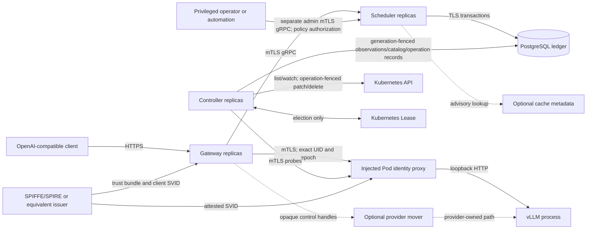
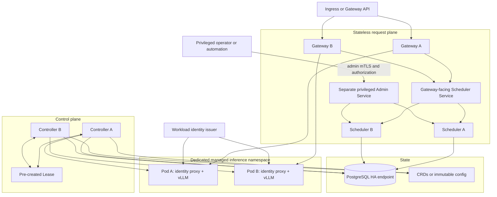
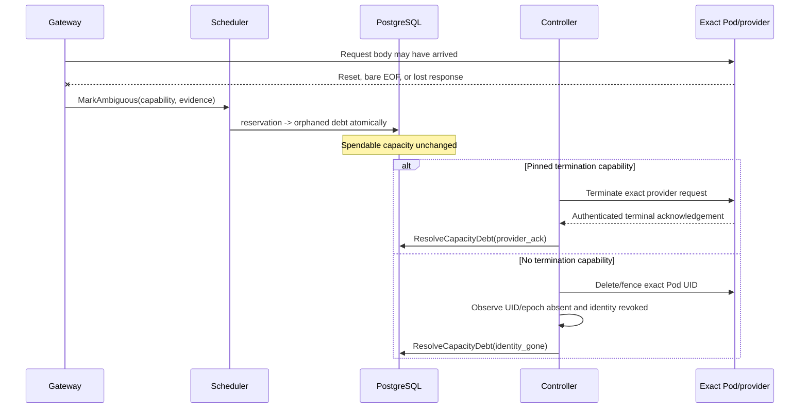
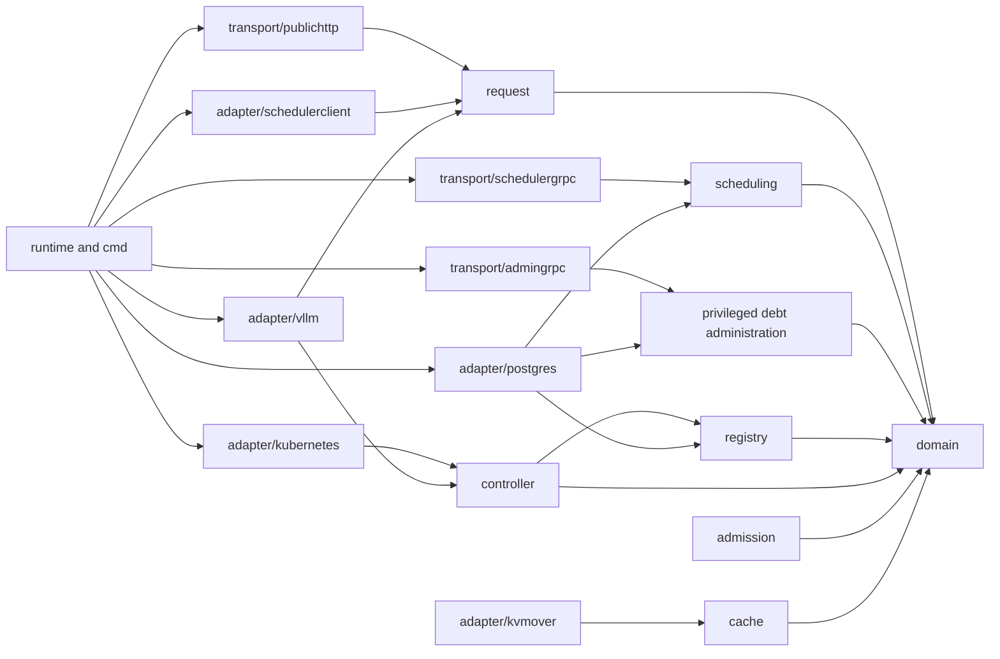

# Prudentia Architecture

## 1. Status, scope, goals, and invariants

### 1.1 Status and scope

**Status:** revised architecture contract, 2026-07-21.

Prudentia is a single-cluster inference control layer for Kubernetes-hosted vLLM. Its client and domain contracts are provider-neutral; its first provider adapter is pinned to an exact vLLM image digest and a signed, contract-tested capability manifest.

Prudentia has three continuously running control-plane binaries:

1. **Gateway** — stateless, active-active public HTTP ingress and synchronous response owner.
2. **Scheduler** — stateless, active-active internal gRPC service. Every replica runs the same pure placement policy and uses PostgreSQL transactions for authoritative idempotency lookup, admission, reservation, rerank abandonment, terminal give-up, dispatch authorization, debt conversion, and release. The same binary also hosts a separately addressed privileged admin listener.
3. **Controller** — Kubernetes observer and level reconciler. A Kubernetes Lease reduces concurrent control work; PostgreSQL owns the controller writer generation for observation/catalog writes and durable workload-operation generations/tokens, while Kubernetes-visible UID/resourceVersion/token preconditions fence disruptive scale/drain mutations.

PostgreSQL is an external required dependency and the authoritative transactional ledger. Kubernetes, telemetry backends, the pinned inference fleet, SPIFFE/SPIRE or equivalent workload-identity infrastructure, the injected authenticated per-Pod proxy, and optional provider-owned KV movers are deployment dependencies rather than additional Prudentia request-plane services.

**MVP:** authenticated and authorized chat-completion ingress; streaming and bounded nonstreaming cold inference; deterministic global scheduling; durable admission, capacity, reservation, drain, and orphan-debt accounting; exact workload authentication before any request body is sent; conservative discovery and health; graceful lifecycle; and operational recovery.

**Optional capabilities:** provider-confirmed request termination, tenant-salted provider prefix caching, request-specific cache metadata, and explicit provider-owned KV transfer. Each is disabled unless an exact capability manifest and its contract suite enable it.

### 1.2 Goals

- Preserve capacity, quota, identity, drain, and idempotency invariants across gateway, scheduler, controller, database, and provider failures.
- Keep public and domain contracts independent of Kubernetes and vLLM wire representations.
- Dispatch one request at most once to one exact, fresh Pod UID and endpoint epoch.
- Never reissue capacity while possibly dispatched work might still execute.
- Converge desired and observed Kubernetes state despite relists, duplicate events, delayed calls, and temporary controller overlap.
- Make cold inference correct without cache metadata or KV-transfer facilities.
- Expose stable errors and useful audit/telemetry data without retaining prompts or completions.

### 1.3 Non-goals

- Exactly-once provider execution, response replay, transparent POST retry, stream resumption, or an asynchronous job API.
- Treating a client deadline, TCP close, context cancellation, or elapsed time as proof that vLLM stopped executing.
- Generic stock-vLLM KV export/import, mandatory disaggregated prefill, or moving KV bytes through Prudentia.
- Multi-cluster federation, scheduler sharding, learned placement, hedging, preemption, or cross-tenant cache sharing.
- Using CRDs, Kubernetes Leases, informer memory, or provider metrics as transactional request accounting.
- Managing arbitrary workloads. Unmanaged workloads are discovery-only and are never deleted or scaled by Prudentia.

### 1.4 Quality attributes

| Attribute | Contract |
|---|---|
| Correctness | PostgreSQL row locks, constraints, database time, coordinated HMAC versions, exact identities/capabilities, and Kubernetes atomic workload-operation preconditions protect idempotency, admission, capacity, and scale handoff. |
| Safety after ambiguity | Possibly dispatched work becomes durable orphaned capacity debt. Time alone never restores its capacity. |
| Availability | Gateways and schedulers are active-active. Conservative unavailability or underutilization is preferred to duplicate execution or oversubscription. |
| Boundedness | Bodies, output, diagnostics, queues, retries, worker pools, deadlines, metadata, and shutdown grace are bounded. |
| Evolvability | Ports point inward; public, protobuf, Kubernetes, and vLLM DTOs are boundary-local; schemas roll out additively. |
| Security | Explicit authentication and authorization, pod-bound mTLS, encrypted capabilities, tenant cache isolation, and redaction are defaults. |
| Operability | RED metrics, freshness, retained grants/give-up, drain/operation barriers, debt/unsafe override, recovery-fence, and identity signals cover every boundary. |
| Testability | Pure policy, domain values, clocks, stores, adapters, and sinks are independently testable; external contracts have pinned suites. |

### 1.5 Architectural invariants

1. **One transactional ledger.** PostgreSQL owns request/idempotency records, admission grants, configured capacity, reservations, orphaned capacity debt, drain intent, controller writer generation, durable workload-operation generations/tokens, recovery admission state, and normalized observations. Process memory is never authority.
2. **Pure ranking, transactional reservation.** Ranking has no I/O, mutation, clock read, or randomness. `TryReserve` rechecks every authoritative predicate in one database transaction. A conflict causes a bounded database reread and rerank.
3. **Capacity precedes dispatch.** A reservation consumes capacity before the scheduler discloses an endpoint. Provider observations may subtract or block capacity but never create spendable capacity.
4. **Drain serializes with admission.** Drain activation and `TryReserve` lock the same exact capacity row. `TryReserve` also locks and checks the authoritative drain intent in that transaction; no projection lag can admit work after drain activation commits.
5. **Pre-dispatch abandonment is explicit.** `AbandonBeforeDispatch` releases only a never-dispatched reservation and retains its one admission grant for a bounded rerank. `GiveUpBeforeDispatch` is a distinct idempotent terminal transition for cancellation, budget expiry, or exhausted reranks; it releases both the current `reserved` reservation, if any, and the retained grant. The database-time classification sweep performs the same terminal give-up for stranded pre-dispatch state.
6. **No time-based release of possibly dispatched work.** A reservation proven never dispatched may be terminally given up using database time. Once dispatch authorization might have reached a gateway, elapsed time can only convert the reservation to durable orphaned capacity debt; it cannot make the slots spendable.
7. **Positive evidence releases possibly dispatched capacity.** Valid streaming protocol finish, complete bounded nonstreaming response plus EOF, a pinned authenticated provider termination acknowledgement, or proof that the exact Pod UID/endpoint epoch is gone and cannot execute may release capacity. A bare EOF, cancellation, socket close, client deadline, or controller timeout is not proof.
8. **Debt is durable and exact.** Orphaned debt is bound to the reservation, tenant, Pod UID, endpoint epoch, and slot cost. `ResolveCapacityDebt` accepts only validated provider-termination or identity-gone evidence. `UnsafeOverrideCapacityDebt` is a separate privileged administrative use case with a separately authenticated and authorized principal, explicit danger confirmation, ticket, reason, an immutable audit event, and dedicated metric and alert.
9. **No unsafe replay.** After a provider attempt may have begun, Prudentia never automatically issues another POST. `X-Request-Id` is correlation only, not a deduplication, query, cancellation, or replay contract.
10. **Exact identity before body bytes.** The gateway completes mTLS and verifies a pod-bound identity containing immutable Pod UID and endpoint epoch before exposing or reading the request body to the HTTP transport. Stock vLLM does not provide this identity; an injected authenticated proxy backed by SPIFFE/SPIRE or an equivalent attested issuer is required infrastructure.
11. **Freshness uses database time.** PostgreSQL timestamps accepted observations and computes expiry from an allowlisted TTL policy. Controller wall clocks and source-supplied expiry timestamps are diagnostic only and never determine eligibility.
12. **Database-owned controller generation.** Leadership acquisition transactionally increments the PostgreSQL writer generation. Observation, catalog, and durable workload-operation mutations compare it in the same transaction. The Kubernetes Lease and Go cancellation do not fence already accepted Kubernetes API calls.
13. **Kubernetes-visible operation fencing.** Every managed drain, scale, or exact removal belongs to a durable monotonically increasing operation generation and unique operation token mirrored on the workload, and on a target Pod before exact deletion. Scale patches atomically test workload UID, resourceVersion, generation, and token before replacing replicas; exact deletes test Pod UID and the resourceVersion created by its token annotation. On handoff, the new controller keeps admission/drain closed, advances and observes a workload and current-Pod barrier, waits out old bounded API calls, relists and accounts for actual victims, and only then may clear drain. Kubernetes API atomic preconditions—not Lease loss or Go cancellation—make older mutations fail.
14. **Single response owner.** One synchronous `Infer` call owns scheduling, optional cache preparation, exact dialing, provider body closure, downstream backpressure, cancellation, terminal evidence, and final accounting. There is no detached stream goroutine or unbounded event channel.
15. **Cache is optional and tenant-isolated.** Cold inference is mandatory. Multi-tenant stock-vLLM automatic prefix caching is disabled. Prefix caching is enabled only on tenant-dedicated engines or with a pinned, contract-tested tenant cache salt applied to every request.
16. **Level reconciliation.** Watches enqueue keys; reconciliation reads current level state. CRDs hold low-rate desired state and status, never reservations, debt, or metric history.
17. **Boundary isolation.** Only `internal/adapter/kubernetes` imports Kubernetes objects. Only `internal/adapter/vllm` contains vLLM DTOs, routes, SSE rules, and provider diagnostics. Public and protobuf DTOs are converted immediately to immutable domain values.
18. **No sensitive persistence.** Raw prompts, raw idempotency keys, completions, bearer credentials, raw provider bodies, plaintext reservation capabilities, and mover tickets are not persisted, logged, traced, or used as metric labels.
19. **Restore is a fleet event.** Any PostgreSQL recovery with possible committed-data loss fences admission and dispatch, makes all pre-restore executions impossible, rolls the entire inference fleet to new workload epochs, and rebuilds observations and capacity before reopening. Database restore alone is unsafe.

## 2. Context, deployment, flow, and repository

### 2.1 System context



The proxy is part of the managed inference Pod, not a stock-vLLM feature. It obtains an attested certificate whose identity binds cluster, namespace, immutable Pod UID, and endpoint epoch; accepts only authenticated gateway/probe clients; and forwards only to loopback vLLM. Certificate rotation may change keys but not the asserted workload identity. Discovery publishes the proxy endpoint only after the expected identity registration is ready.

MVP has no trusted-network fallback. A deployment that cannot present and verify Pod UID plus endpoint epoch is not eligible for direct dispatch. A future explicitly weaker mode would be nonconforming, would expose a replacement TOCTOU window, and would have to quarantine capacity across endpoint replacement until the old execution risk was positively cleared; it is not specified or enabled here.

### 2.2 Deployment view



Schedulers do not elect a leader. Controller followers may warm informer caches. After Lease acquisition, the leader must acquire a newer database writer generation before writer work. Before touching or reopening any workload with an incomplete/recent managed operation, it closes/retains admission, advances and reads back the Kubernetes-visible operation barrier, waits the bounded old-call lifetime, and reconciles actual victims. Loss of the Lease cancels work best-effort; correctness does not assume cancellation retracts an accepted SQL or Kubernetes request.

### 2.3 Normal request sequence

```mermaid
sequenceDiagram
    participant Client
    participant Gateway
    participant Scheduler
    participant DB as PostgreSQL
    participant Proxy as Exact Pod proxy
    participant V as vLLM

    Client->>Gateway: POST /v1/chat/completions
    Gateway->>Gateway: Authenticate/authorize; derive tenant HMAC lookup and digest candidates
    Gateway->>Scheduler: Schedule(metadata, lookup+digest candidates, coordinated write versions, attempt ID)
    Scheduler->>DB: Read database-timestamped candidate catalog
    Scheduler->>Scheduler: Pure deterministic Rank
    Scheduler->>DB: TryReserve transaction
    DB-->>Scheduler: Reservation + recoverable capability; no endpoint
    Scheduler-->>Gateway: Reservation
    Gateway->>Scheduler: PrepareDispatch(capability)
    Scheduler->>DB: Fence check; lock reservation/capacity/drain; authorize dispatch
    DB-->>Scheduler: Exact endpoint, UID, epoch, remaining budget
    Scheduler-->>Gateway: Dispatch target
    Gateway->>Proxy: TLS handshake; verify exact UID and epoch
    Proxy-->>Gateway: Verified identity
    Gateway->>V: Exactly one request body through proxy
    loop Synchronous backpressure
      V-->>Gateway: Provider event
      Gateway-->>Client: Public event or bounded collection
    end
    V-->>Gateway: Valid protocol finish / complete response EOF
    Gateway->>Scheduler: Finalize(capability, terminal proof)
    Scheduler->>DB: Release reservation and grant exactly once
```

`PrepareDispatch` changes the reservation to `dispatch_authorized` before returning an endpoint. From that commit onward, a lost response means dispatch is possible. If the gateway proves no request body byte was sent, it may finalize with `not_sent`. Otherwise failure becomes orphaned debt; no elapsed-time sweep releases it.

### 2.4 Pre-dispatch rerank and terminal give-up sequence

```mermaid
sequenceDiagram
    participant G as Gateway request owner
    participant S as Scheduler
    participant DB as PostgreSQL
    participant W as Scheduler sweeper

    G->>S: Schedule(candidates, write versions, attempt ID)
    S->>DB: Reserve capacity and one admission grant
    S-->>G: Reservation R1
    G->>S: PrepareDispatch(R1)
    S-->>G: stale/draining before authorization
    G->>S: AbandonBeforeDispatch(R1, rerank reason)
    S->>DB: R1 -> abandoned_rerank; release capacity; retain grant
    alt budget and another ranked candidate remain
      G->>S: Schedule(same logical command and attempt)
      S->>DB: Reuse grant; create current reservation generation R2
      S-->>G: R2
    else canceled, budget expired, or reranks exhausted
      G->>S: GiveUpBeforeDispatch(latest-or-last ref, terminal reason)
      S->>DB: release current reserved reservation if any and retained grant
      DB-->>S: terminal given_up, idempotent
    end
    opt gateway disappears while reserved or rerank_pending
      W->>DB: classification sweep at classification_after
      DB->>DB: same terminal give-up; release reservation if any and grant
    end
```

`AbandonBeforeDispatch` is nonterminal and exists only to move from one never-dispatched candidate to a bounded rerank. `GiveUpBeforeDispatch` is terminal. The latest reservation capability remains valid for give-up after that reservation became `abandoned_rerank`; an older request generation cannot terminate a later reservation. A lost give-up response is retried with identical bytes. If no gateway survives, the database classification deadline completes the same transition.

### 2.5 Ambiguous request and debt sequence



A sweep may perform the same reservation-to-debt conversion if the gateway died after dispatch authorization. A manual unsafe override uses a separate privileged operation, never the normal resolution path.

### 2.6 PostgreSQL PITR recovery sequence

```mermaid
sequenceDiagram
    participant Op as Recovery automation/operator
    participant G as Gateway/Scheduler
    participant DB as Restored PostgreSQL
    participant C as Controller
    participant Fleet as Entire inference fleet

    Op->>G: Block ingress dispatch path / stop request-plane admission
    Op->>DB: Restore and run BeginRecoveryFence(unique recovery epoch)
    DB-->>G: admission=closed, dispatch=closed
    C->>DB: Acquire new controller writer generation
    alt Provider has pinned fleet-quiescence proof
      C->>Fleet: Drain and prove every old epoch quiescent
    else Stock vLLM
      C->>Fleet: Delete/restart every exact old Pod UID
    end
    C->>Fleet: Roll all workloads with new recovery/workload epochs and SVIDs
    C->>DB: Relist; record fresh observations; sync capacity projections
    C->>DB: Reconcile restored rows against fenced old identities
    Op->>DB: ReopenAfterFleetRebuild(attestation)
    DB-->>G: admission=open, dispatch=open
```

The infrastructure fence is established before a potentially lossy restore is exposed to request-plane processes. A restored row that says `open` is not trusted: startup also requires the operator-supplied recovery epoch to match the post-restore fence record. Unplanned failover may reopen immediately only when the database service guarantees no committed transaction loss; any uncertainty invokes this procedure.

### 2.7 Dependency direction



Inward-facing interfaces live beside the consuming application package; there is no generic `ports` package. `internal/domain` imports no transport or infrastructure package. Import checks enforce adapter isolation.

### 2.8 Repository layout

```text
api/
  scheduler/v1/scheduler.proto
  admin/v1/capacity_debt_admin.proto
cmd/
  gateway/main.go
  scheduler/main.go
  controller/main.go
internal/
  domain/                         # immutable backend-neutral values and errors
  auth/                           # public/service/admin authentication and explicit authorization
  request/                        # synchronous inference lifecycle and ports
  admission/                      # pure admission policy
  scheduling/                     # rank and scheduler application service
  registry/                       # observation merge and candidate catalog use cases
  controller/                     # level reconciliation, drain, and recovery workflows
  cache/                          # optional compatibility metadata and coordination
  transport/
    publichttp/                   # mutable public DTOs, handlers, SSE/JSON encoders
    schedulergrpc/                # gateway protobuf boundary, server, typed errors
    admingrpc/                    # separate privileged debt-override boundary
  adapter/
    schedulerclient/              # mTLS gRPC client and retry policy
    postgres/                     # transactional ledger/catalog
    kubernetes/                   # sole Kubernetes object boundary
    vllm/                         # sole vLLM protocol boundary and exact TLS verification
    kvmover/                      # optional pinned opaque control protocol
  config/
  health/
  observability/
  runtime/
migrations/
deploy/                           # CRDs, RBAC, admission, identity, policies, workloads
tests/
  contract/
  functional/
  integration/
docs/
  architecture.md
```

## 3. Domain model and data ownership

### 3.1 Enforced immutable values

Domain values use unexported fields. Constructors validate all enum/version values and defensively copy mutable input. Accessors return scalar values, immutable value objects, or copies. `FeatureSet` is a fixed-size value bitset for the supported schema version. Slice/map-backed `Input`, `OutputDelta`, cache hints, and extension sets are hidden and cloned on construction and access. Optional values use `(value, bool)` accessors rather than exported pointers.

```go
type InferenceRequest struct {
    requestID       RequestID
    model           ModelKey
    input           Input
    maxOutputTokens uint32
    priority        Priority
    features        FeatureSet
    cachePolicy     CachePolicy
    executionBudget time.Duration
    idempotencyKey  SecretString
}

func (r InferenceRequest) Input() Input { return r.input.Clone() }
func (r InferenceRequest) Features() FeatureSet { return r.features }


type IdempotencyLookupCandidate struct {
    pepperVersion LookupPepperVersion
    value         [32]byte
}

type ScheduleCommand struct {
    requestID              RequestID
    attemptID              AttemptID
    tenant                 TenantScope
    idempotencyCandidates  []IdempotencyLookupCandidate
    lookupWriteVersion     LookupPepperVersion
    digestCandidates       []RequestDigest
    digestWriteVersion     DigestVersion
    model                  ModelKey
    slotCost               uint32
    features               FeatureSet
    executionBudget        time.Duration
}

func (c ScheduleCommand) IdempotencyCandidates() []IdempotencyLookupCandidate {
    return slices.Clone(c.idempotencyCandidates)
}

type WorkloadIdentity struct {
    cluster, namespace, logicalEngine string
    podUID                            string
    endpointEpoch                     EndpointEpoch
    recoveryEpoch                     RecoveryEpoch
}

type InstanceSnapshot struct {
    identity          WorkloadIdentity
    endpoint          EndpointRef
    model             ModelFingerprint
    capabilities      FeatureSet
    structural        StoredSourceStamp
    health            StoredSourceStamp
    load              OptionalStoredSourceStamp
    healthState       HealthState
    drainState        DrainState
    configuredSlots   uint32
    reservedSlots     uint32
    orphanedSlots     uint32
    advisoryLoad      OptionalLoad
    cacheHints        []CacheHint
    projectionVersion uint64
    catalogAsOf       DatabaseTimestamp
}

func (s InstanceSnapshot) CacheHints() []CacheHint {
    return slices.Clone(s.cacheHints)
}

type StreamEvent struct {
    kind  EventKind
    delta OutputDelta
    usage Usage
    hasUsage bool
}
```

Public JSON DTOs, protobuf messages, Kubernetes objects, SQL scan structs, and vLLM DTOs may be mutable, but they live only inside their boundary packages. They are never type aliases of domain values.

`RequestID` is correlation. `AttemptID` identifies one live public gateway attempt and is reused only for transport retry of that attempt's scheduling RPC. `Idempotency-Key` is tenant-scoped and exists only in bounded gateway memory long enough to derive candidates; it never crosses gRPC. `ScheduleCommand` contains a bounded, version-sorted HMAC candidate set for every retained lookup pepper and the database-coordinated lookup write version, plus the corresponding canonical digest candidates and digest write version. `ReservationCapability` is opaque to the gateway and bound to reservation ID, request generation, owner attempt, exact identity, and key versions.

For TP/DP engines, `LogicalEngine` denotes the API leader plus a complete immutable worker-membership digest. Any membership change creates a new endpoint epoch and makes the old projection ineligible.

An observation command contains source kind, controller writer generation, source sequence, exact identity, normalized fact, TTL class, and optional source-reported diagnostic timestamp. It does **not** contain authoritative `accepted_at` or `expires_at`; PostgreSQL assigns both.

A cache compatibility identity contains tenant security scope, HMAC key version and prefix-token digest, model weights/tokenizer/config digests, cache format/content version, block size, dtype/quantization, attention backend, TP/DP layout, and exact provider/connector manifest. Prompt equality alone is never compatibility.

### 3.2 State model

Reservation states are:

- `reserved` — capacity consumed; endpoint never disclosed. It may move to nonterminal `abandoned_rerank`, or a terminal give-up may release it because dispatch is structurally impossible.
- `abandoned_rerank` — the never-dispatched reservation released its capacity, while the request's admission grant remains `retained_rerank` for a bounded next candidate. It is not terminal success or terminal give-up.
- `dispatch_authorized` — endpoint may have reached the gateway. Time may convert it to debt but may not release capacity.
- `streaming` — observational; request body was reported sent.
- `released` — valid terminal provider proof, definitive `not_sent`, or terminal pre-dispatch give-up released every contribution applicable to that state.
- `orphaned` — reservation contribution was atomically moved to durable orphaned capacity debt.

Admission-grant states are `active_reserved`, `retained_rerank`, `orphaned`, and `released`. A request has at most one contributing grant. Only `AbandonBeforeDispatch` can produce `retained_rerank`; `GiveUpBeforeDispatch` or the pre-dispatch classification sweep changes `active_reserved` or `retained_rerank` to `released` and decrements the tenant counter exactly once.

Debt states are `active`, `resolved_provider_termination`, `resolved_identity_gone`, and `unsafe_overridden`. The first two resolved states arise only from validated evidence through `ResolveCapacityDebt`; `unsafe_overridden` arises only from the separate privileged administrative operation.

Drain states are `requested`, `active`, `forced`, `removing`, and `complete`. Activation immediately sets the exact capacity row's admission limit to zero and creates/updates the drain intent under the same lock. Forced state never releases a reservation or debt by itself. Workload-operation phases are `barrier_pending`, `barrier_observed`, `mutating`, `observing_victims`, and `complete`; a durable operation generation/token is monotonically advanced on every new operation and controller handoff.

### 3.3 Ownership and consistency

| Data | Authoritative owner/writer | Consistency and freshness | Retention/exposure |
|---|---|---|---|
| Raw request and response | Gateway request goroutine | In-memory, synchronous, bounded | Never persisted or logged |
| Request ID, versioned idempotency lookup HMAC, digest set, stage/outcome | PostgreSQL via scheduler | Transactional; gateway supplies bounded retained-version candidates and coordinated write versions | Through idempotency and mutation-retry windows; raw key never leaves gateway memory |
| Admission grant and tenant counters | PostgreSQL via scheduler | Same transaction as reservation; exact transition | Audited; tenant not a metric label |
| Capacity, active reservations, orphaned debt | PostgreSQL | Exact-identity row locks and checks | Debt remains until positive resolution |
| Drain intent | PostgreSQL catalog | Same capacity-row serialization as reservation | Until exact removal/status completion |
| Workload operation generation/token and barrier proof | PostgreSQL plus mirrored Kubernetes workload/Pod annotations | DB generation-fenced issuance; Kubernetes UID/resourceVersion/token atomic preconditions | Through operation, handoff, victim observation, and audit window |
| Controller writer generation | PostgreSQL | Atomic increment; compared on every controller catalog write | Current plus audit history |
| Structural/provider observations | PostgreSQL catalog | DB `accepted_at`; DB-derived expiry; source generation/sequence | Normalized facts only |
| Desired state | CRD or immutable config | Kubernetes generation and level reconciliation | Low-rate spec/status |
| Provider load | Pinned parser, normalized in PostgreSQL | Advisory; stale is unknown and cannot add capacity | Current sample; history external |
| Cache metadata | Optional adapter | Tenant- and manifest-bound, short TTL, advisory | HMAC identity only |
| Reservation capability | Gateway memory and encrypted PostgreSQL ciphertext | Envelope encrypted plus comparison hash | Never public/logged; key retained through retry window |
| KV bytes/mover descriptors | Provider or external mover | Provider-defined, capability-gated | Never enter Prudentia |
| Telemetry | OTel/Prometheus | Best effort, non-authoritative | Redacted, low-cardinality |

## 4. Module catalog, boundaries, and test points

The catalog lists architectural constructors, ports, and use cases—not every parser helper or generated method. Each listed function has all three requested test levels. For a pure constructor, the integration column names a higher-level boundary contract that exercises it rather than pretending the constructor itself needs live infrastructure.

- **Unit:** in-process, no external I/O.
- **Functional:** package/process boundary with deterministic fakes, `httptest`, fake Kubernetes clients, or ephemeral PostgreSQL where SQL semantics are the behavior.
- **Integration:** real supported external boundary or multi-process contract.

### 4.1 `internal/domain`

| Implementable signature | Rationale and boundary/failure semantics | Unit | Functional | Integration |
|---|---|---|---|---|
| `func NewInferenceRequest(p InferenceRequestParams) (InferenceRequest, error)` | Establish the only valid public-request domain shape; copies messages/maps and rejects unknown enums, versions, invalid budgets, empty revisions, and bounds before data reaches policy. Accessors clone mutable state. | Mutation-after-construction, accessor mutation, enum/version, size and duration edges. | Public JSON fixtures normalize to equal values; malicious DTO mutation cannot change the value. | Official client requests cross the live HTTP boundary and unsupported fields fail before scheduling. |
| `func NewScheduleCommand(p ScheduleParams) (ScheduleCommand, error)` | Bind request, attempt, tenant, bounded idempotency lookup candidates, coordinated lookup write version, digest candidates, coordinated digest write version, model, slot cost, features, and execution budget; no raw idempotency key, endpoint, or prompt is allowed. An absent public key is represented only by an empty lookup set and zero lookup write version. | Missing write candidate, write-version mismatch, duplicate/unsorted/unknown candidate versions, candidate count/byte bounds, illegal empty combination, zero slot cost, attempt/ID bounds. | Protobuf round-trip preserves every execution-affecting field and proves raw keys cannot be represented. | Old/new gateway and scheduler versions perform retained-pepper rotation without logical duplicates and fail closed on unknown versions. |
| `func NewWorkloadIdentity(p WorkloadIdentityParams) (WorkloadIdentity, error)` | Create an exact identity containing cluster, namespace, engine, Pod UID, endpoint epoch, and recovery epoch. Values are scalar and immutable. | Empty/malformed UID, zero/unknown epochs, canonical comparison. | Kubernetes normalization and TLS claim decoding produce the same identity fixture. | Kind Pod plus issued SVID verifies exact identity; replacement produces inequality. |
| `func NewInstanceSnapshot(p SnapshotParams) (InstanceSnapshot, error)` | Create an immutable ranking snapshot from normalized stored facts; clone cache hints and reject cross-identity stamps, impossible counters, unsafe versions, or future catalog timestamps. | Defensive copies, invalid state matrix, capacity/debt bounds, optional-value accessors. | Registry reorder/project fixtures converge to byte-equivalent accessor results. | Two scheduler versions rank the same PostgreSQL snapshot fixtures identically. |
| `func NewReservationRef(p ReservationRefParams) (ReservationRef, error)` | Keep the opaque capability and request generation together; reject missing/oversize capabilities and unsafe generations. Plaintext is boundary-confined and redacted by formatting. | Bounds, redacted `String`, clone/zeroization behavior at owning boundary. | gRPC codec never logs or exposes the capability in errors. | Lost `Schedule` response recovered by another scheduler returns the same valid capability over mTLS. |
| `func NewStreamEvent(p StreamEventParams) (StreamEvent, error)` | Enforce legal `Delta`, `Usage`, and `Terminal` variants without exported pointers/slices; terminal carries provider-proof classification, not arbitrary text. | Variant matrix, copied token bytes, duplicate/unknown terminal kinds. | vLLM parser to SSE/JSON sinks preserves event order and immutability. | Pinned streaming and nonstreaming responses satisfy the shared event contract. |

### 4.2 `internal/auth` and `internal/transport/publichttp`

| Implementable signature | Rationale and boundary/failure semantics | Unit | Functional | Integration |
|---|---|---|---|---|
| `func (a *Authenticator) Authenticate(ctx context.Context, r *http.Request) (domain.Principal, error)` | Verify configured OIDC/JWT or API-key credentials and return bounded identity claims. Missing, expired, wrong issuer/audience, or unresolved keys are `unauthenticated`; no fallback principal. | Expiry/skew, issuer/audience, key rotation, malformed claims. | Ephemeral JWKS refresh/outage and principal propagation. | Live gateway with ephemeral TLS OIDC issuer; invalid credentials never reach authorization. |
| `func DecodeChat(r *http.Request, limits Limits) (domain.InferenceRequest, ResponseMode, error)` | Bound and decode the supported mutable public DTO, reject unknown/ignored provider fields, then construct an immutable domain request. It never trusts client internal IDs or backend headers. | Body/message/token bounds, streaming flag, durations, unknown fields, malformed JSON. | Public fixtures through handler prove exact normalization and body close. | Official OpenAI client exercises supported streaming/nonstreaming subset. |
| `func (a *Authorizer) Authorize(ctx context.Context, p domain.Principal, req domain.InferenceRequest) (domain.AuthorizedRequest, error)` | Explicitly enforce principal-to-tenant, model revision, feature, cache policy, and priority permissions before digest/scheduling. Denial is stable `forbidden`; no existence-sensitive backend detail is revealed. | Allow/deny matrix, wildcard precedence, tenant mismatch, cache/admin features. | Handler denial proves scheduler, cache, and backend receive zero calls. | Live policy source and gateway return 403 consistently across replicas. |
| `func (h *Handler) ChatCompletions(w http.ResponseWriter, r *http.Request)` | Own authenticate→decode→authorize→infer and HTTP status timing. Streaming starts only after a valid provider event; nonstreaming headers wait for complete collection. Post-start failure truncates without `[DONE]`. | Error precedence, pre/post-start failure, request ID, cancellation. | `httptest` verifies JSON/SSE headers, disconnect propagation, and no downstream calls on denial. | Client→gateway→scheduler→exact proxy→pinned vLLM normal/fault paths. |
| `func (s *SSESink) Write(ctx context.Context, e domain.StreamEvent) error` | Encode and flush synchronously; client speed is backpressure. Emit usage only when present and one `[DONE]` only after a valid provider terminal proof. | Fragment/order, duplicate terminal, usage, flush error, cancellation. | Slow reader proves bounded memory and disconnect unblocks upstream. | Real HTTP/1.1 and HTTP/2 clients observe incremental chunks and truncation semantics. |
| `func (c *NonStreamingCollector) Write(ctx context.Context, e domain.StreamEvent) error` | Collect deltas/usage into a bounded immutable completion result; no response is written until valid terminal proof. Overflow/cancellation returns an error and cancels upstream; it never fabricates a terminal event. | Byte/token/event limits, UTF-8 boundaries, usage, terminal, cancellation. | Fake backend overflow, abrupt EOF, provider error, and successful aggregation. | Pinned vLLM nonstreaming and streaming-normalized inputs produce the documented bounded JSON. |
| `func EncodeNonStreaming(w http.ResponseWriter, id domain.RequestID, r domain.CompletionResult) error` | Emit one bounded OpenAI-compatible JSON response after collection; reject incomplete results and propagate writer errors without retaining output. | Golden JSON, escaping, usage omission, incomplete result, short writer. | `httptest` proves no partial success on provider failure or collector overflow. | Official client decodes a live bounded nonstreaming response. |
| `func WritePublicError(w http.ResponseWriter, id domain.RequestID, err error)` | Map typed errors to stable safe JSON. Never include provider, endpoint, SQL, Kubernetes, cache, token, or identity details. | Complete code/status map, wrapped errors, escaping, redaction. | Inject hostile diagnostics and assert no leakage. | Black-box error fixtures remain compatible across rolling gateway versions. |

### 4.3 `internal/request` and `internal/admission`

| Implementable signature | Rationale and boundary/failure semantics | Unit | Functional | Integration |
|---|---|---|---|---|
| `func IdempotencyLookupCandidates(tenant domain.TenantScope, key domain.SecretString, peppers LookupPepperKeyring, write domain.LookupPepperVersion) (domain.LookupCandidateSet, error)` | In the gateway, derive exactly one bounded candidate for every retained pepper version as `HMAC-SHA-256(pepper_v, "prudentia/idempotency-lookup/v1" || canonical_tenant_scope || 0x00 || raw_key)`, sort by version, and require the coordinated write version to be present. The raw key is zeroized after derivation and is never put in a command, protobuf, log, trace, or database row. | Golden/domain-separation vectors, tenant isolation, missing/duplicate versions, candidate bound, write-version presence, key zeroization. | Old-pepper row is found by a new gateway; new insert uses only the coordinated version; captured gRPC contains no raw key. | Concurrent old/new gateways across pepper rotation resolve one logical request and a changed tenant or key does not alias. |
| `func CanonicalDigests(req domain.AuthorizedRequest, keys DigestKeyring, write domain.DigestVersion) (domain.DigestSet, error)` | Canonicalize all execution-affecting semantics and compute HMAC digests for every retained readable version; return their bounded set plus the database-coordinated current write version. Exclude correlation only; never persist plaintext. | Golden vectors, ordering, field sensitivity, missing write version, version/key rotation. | Rolling fixtures compare a stored old-version digest using supplied candidates while new inserts use one current version. | Old/new gateways concurrently produce one logical idempotency record and detect semantic conflict. |
| `func (p *Policy) Evaluate(req domain.ScheduleCommand, tenant domain.TenantPolicy, usage domain.UsageSnapshot) (domain.AdmissionClaim, error)` | Purely evaluate quota, feature, priority, deadline, and overload policy; PostgreSQL remains final authority. | Exact quota/deadline/priority/feature boundaries. | Policy rejection creates no ledger mutation. | Concurrent schedulers prove database counters, not stale snapshots, enforce limits. |
| `func (s *Service) Infer(ctx context.Context, req domain.AuthorizedRequest, mode domain.ResponseMode, sink domain.StreamSink) error` | Own lookup/digest candidate derivation, schedule, optional cache, dispatch preparation, exact TLS identity, one provider call, response, and accounting. A stale pre-dispatch candidate uses nonterminal `AbandonBeforeDispatch`; cancellation, budget exhaustion, or exhausted reranks after any reservation uses terminal `GiveUpBeforeDispatch` with the latest/last ref. After possible body delivery it never redispatches. | Full state/evidence table; raw-key non-propagation; exactly one of rerank abandonment, terminal give-up, finalization, or ambiguity. | Cancel before prepare, cancel while `retained_rerank`, exhausted reranks, lost give-up response, exact-ID mismatch, slow sink, terminal finish, and ambiguity. | Gateway kill, provider reset, rotation, and normal stream against real scheduler/PostgreSQL/proxy/vLLM preserve grants/capacity/debt. |

### 4.4 `internal/scheduling`

| Implementable signature | Rationale and boundary/failure semantics | Unit | Functional | Integration |
|---|---|---|---|---|
| `func Rank(spec domain.ScheduleCommand, catalog domain.CandidateCatalog, policy domain.PlacementPolicy) ([]domain.RankedCandidate, domain.PlacementExplanation)` | Pure filter/rank over immutable candidates already evaluated at one database timestamp. Stable identity tie-break; stale/unknown optional evidence cannot improve score. | Permutation invariance, every hard filter, scores, ties, capacity/debt edge. | Reordered catalog fixtures yield identical ranking/explanation. | Multiple scheduler versions rank shared compatibility fixtures identically. |
| `func (s *Service) Schedule(ctx context.Context, cmd domain.ScheduleCommand) (domain.Reservation, error)` | Read catalog, rank, and call `TryReserve` with bounded reread/rerank. Same-attempt transport retry recovers the same encrypted capability; `rerank_pending` reuses its grant and advances generation. If all candidates fail after a prior abandonment, return typed exhaustion without guessing terminal intent; request orchestration must call `GiveUpBeforeDispatch` with the last ref. Another attempt cannot steal it. | Retry bound, error precedence, deadline budget, attempt ownership, retained-grant exhaustion. | Fake catalog conflicts/lost response/no-capacity after abandonment; no unreserved target or silently released grant. | Active-active schedulers contend for last slot/quota without oversubscription or grant leakage after gateway give-up/sweep. |
| `func (s *Service) PrepareDispatch(ctx context.Context, ref domain.ReservationRef) (domain.DispatchTarget, error)` | Revalidate exact identity/freshness/drain/recovery gate and change state to `dispatch_authorized` before returning the endpoint. Repetition by the same owner returns the same target while valid. | Token/owner/stage/gate and typed stale errors. | Observation replacement or drain between reserve and prepare fails closed. | Pod replacement and PITR fence ensure no old reservation reaches any provider. |
| `func (s *Service) AbandonBeforeDispatch(ctx context.Context, ref domain.ReservationRef, reason domain.RerankReason) error` | Nonterminally release only a `reserved` reservation whose endpoint was never disclosed, transition it to `abandoned_rerank`, and preserve exactly one admission grant as `retained_rerank` for a bounded rerank. It never means the request is finished. | Legal-stage matrix, wrong token, duplicate operation, terminal-reason rejection. | Abandon then rerank reuses the grant and advances request generation with exact counters. | Endpoint churn before prepare leaks neither capacity nor grants. |
| `func (s *Service) GiveUpBeforeDispatch(ctx context.Context, ref domain.ReservationRef, reason domain.GiveUpReason) error` | Terminally give up a never-dispatched request after cancellation, budget expiry, or exhausted reranks. Validate the current request generation and capability, release its current `reserved` reservation if one exists, release an `active_reserved` or `retained_rerank` grant, and persist `given_up` once. The last abandoned ref is accepted only while it is still the current generation. | Current/last-ref matrix, reason enum, duplicate operation, stale generation, prepared/orphaned rejection, exact decrement set. | Cancellation before prepare, cancellation between abandon/rerank, and no-candidate exhaustion release both contributions; lost response retry is idempotent. | Scheduler failover around give-up leaves no tenant grant or capacity leak and never releases possible dispatch. |
| `func (s *Service) Finalize(ctx context.Context, ref domain.ReservationRef, proof domain.TerminalProof) error` | Release reservation/grant only for a valid provider finish, complete nonstreaming EOF, pinned termination acknowledgement, or definitive local `not_sent`. Identical retries are idempotent. | Proof/state matrix, conflicting outcome, retry horizon. | Lost finalize response decrements once; bare EOF is rejected. | Different scheduler replica finalizes a stream with the recovered capability. |
| `func (s *Service) MarkAmbiguous(ctx context.Context, ref domain.ReservationRef, cause domain.AmbiguousCause) error` | Atomically convert possibly dispatched reservation accounting to durable debt without increasing spendable capacity. No retry or time-based release follows. | Cause/stage matrix and exact counter delta set. | Partial upload/reset creates one debt and no second POST. | Gateway death after provider acceptance leaves debt until provider ack or exact Pod loss. |

### 4.5 `internal/transport/schedulergrpc` and `internal/adapter/schedulerclient`

The gateway-facing protobuf service exposes unary `Schedule`, `PrepareDispatch`, `AbandonBeforeDispatch`, `GiveUpBeforeDispatch`, `Finalize`, and `MarkAmbiguous`. Server interceptors require an allowlisted gateway SPIFFE identity, enforce method/message/deadline limits, and attach versioned typed error details. Unknown enum/schema versions fail closed. The relevant wire shape is normative:

```proto
message IdempotencyLookupCandidate {
  uint32 pepper_version = 1;
  bytes hmac_sha256 = 2; // exactly 32 bytes
}
message RequestDigestCandidate {
  uint32 digest_version = 1;
  bytes hmac_sha256 = 2; // exactly 32 bytes
}
message ScheduleRequest {
  string request_id = 1;
  string attempt_id = 2;
  bytes tenant_scope = 3; // bounded canonical opaque scope, not a public tenant string
  repeated IdempotencyLookupCandidate idempotency_lookup_candidates = 4;
  uint32 lookup_write_version = 5;
  repeated RequestDigestCandidate digest_candidates = 6;
  uint32 digest_write_version = 7;
  // bounded model, slot, feature, budget, priority, and schema fields follow
}
message AbandonBeforeDispatchRequest {
  ReservationRef ref = 1;
  RerankReason reason = 2;
}
message GiveUpBeforeDispatchRequest {
  ReservationRef ref = 1;
  GiveUpReason reason = 2; // CANCELED, BUDGET_EXPIRED, or RERANKS_EXHAUSTED
}
```

The wire/domain constants are `MaxLookupCandidates = 4` and `MaxDigestCandidates = 4`; startup fails if a retained keyring exceeds its bound. If the public request has no `Idempotency-Key`, `idempotency_lookup_candidates` is empty and `lookup_write_version` is zero; otherwise the set has `1..4` entries, is version-unique and sorted, contains every configured retained version, and contains the coordinated write version. The digest set always has `1..4` entries and contains its coordinated write version. There is deliberately no raw-key protobuf field. Abandon and give-up use distinct enums and DTOs so rerank intent cannot accidentally terminalize, and terminal intent cannot be mistaken for permission to rerank.

| Implementable signature | Rationale and boundary/failure semantics | Unit | Functional | Integration |
|---|---|---|---|---|
| `func (c Codec) DecodeSchedule(m *schedulerv1.ScheduleRequest) (domain.ScheduleCommand, error)` | Bound repeated fields/strings, reject prompts/endpoints/raw idempotency material/unknown versions, validate version-sorted lookup and digest candidate sets and both coordinated write versions, then construct the immutable command. | Empty/optional combinations, count/byte bounds, unknown or duplicate versions, missing write candidate, malicious fields, raw-key absence. | Fuzzed protobuf input cannot bypass domain validation or allocate beyond limits; encode/decode preserves all candidates and write versions. | Old/new clients across lookup and digest rotation find old rows, write current versions, and reject unsafe future enums. |
| `func (c Codec) DecodeReservationRef(m *schedulerv1.ReservationRef) (domain.ReservationRef, error)` | Validate IDs/generation/capability size without logging plaintext; used by every mutation RPC. | Missing/oversize token, generation, redacted errors. | All mutation handlers reject malformed refs before service calls. | mTLS mutation with a wrong capability is denied and audited without leakage. |
| `func (c Codec) EncodeReservation(v domain.Reservation) (*schedulerv1.Reservation, error)` | Convert only bounded internal metadata and the opaque capability; never include prompt, Kubernetes DTO, provider DTO, or raw diagnostics. | Field completeness, size, unknown domain version. | Encode/decode contract and logging redaction. | Lost response recovered through another server yields the identical capability bytes. |
| `func (c Codec) EncodeError(err error) (codes.Code, *schedulerv1.ErrorDetail)` | Produce stable versioned internal errors and bounded retry hints; unexpected details are sanitized. | Complete mapping, wrapped errors, unknown types, redaction. | Server/client round-trip retains safe typed meaning. | Rolling versions interpret supported errors identically and fail closed otherwise. |
| `func (s *Server) Schedule(ctx context.Context, m *schedulerv1.ScheduleRequest) (*schedulerv1.ScheduleResponse, error)` | Authenticate gateway role, decode bounded candidate sets/write versions, invoke scheduling once, and encode. Transport retries are safe only because attempt ID and full command bytes are unchanged. | Auth context, candidate codec/service errors, deadline. | In-process gRPC lost-response/retry returns the same reservation; raw-key marker never reaches service/logs. | Two mTLS gateways and scheduler replicas contend safely across a coordinated pepper rotation. |
| `func (s *Server) PrepareDispatch(ctx context.Context, m *schedulerv1.PrepareDispatchRequest) (*schedulerv1.PrepareDispatchResponse, error)` | Decode exact capability and invoke dispatch authorization; endpoint is returned only on committed success. | Unknown ref, gate/stale mapping, response bounds. | Drop response after commit; retry returns same target but remains possibly dispatched. | Recovery fence and Pod replacement block dispatch across real processes. |
| `func (s *Server) AbandonBeforeDispatch(ctx context.Context, m *schedulerv1.AbandonBeforeDispatchRequest) (*emptypb.Empty, error)` | Expose only the nonterminal never-dispatched rerank transition and validate `RerankReason`. | Stage/reason/error mapping; terminal reasons are unrepresentable. | Duplicate RPC is idempotent, grant remains retained, and prepared state is rejected. | Scheduler failover around abandon preserves the grant and releases only reservation capacity. |
| `func (s *Server) GiveUpBeforeDispatch(ctx context.Context, m *schedulerv1.GiveUpBeforeDispatchRequest) (*emptypb.Empty, error)` | Authenticate the gateway, decode the exact current/last ref and terminal `GiveUpReason`, and invoke the idempotent terminal transition. | Reject unknown reason, stale generation, or any possibly dispatched state; return success for the identical terminal result. | In-process cancellation/exhaustion and dropped response release reservation/grant once. | A different scheduler replica accepts the identical retry and no retained grant remains. |
| `func (s *Server) Finalize(ctx context.Context, m *schedulerv1.FinalizeRequest) (*emptypb.Empty, error)` | Validate terminal-proof enum/version and exact capability; no raw provider body crosses RPC. | Proof/version matrix and conflicting finalization. | Lost response retry decrements once. | Live terminal stream finalizes through a different scheduler replica. |
| `func (s *Server) MarkAmbiguous(ctx context.Context, m *schedulerv1.MarkAmbiguousRequest) (*emptypb.Empty, error)` | Validate bounded evidence class and create debt; never maps ambiguity to release. | Unknown cause and illegal state. | Partial upload fixture yields debt. | Provider reset shows debt metrics and no capacity reuse. |
| `func (c *Client) Schedule(ctx context.Context, cmd domain.ScheduleCommand) (domain.Reservation, error)` | Encode lookup/digest candidates and both write versions, assert no raw-key field exists, then make the mTLS call with bounded retries only for pre-response transport failures and identical attempt/command bytes. Decode typed errors and response strictly. | Candidate encode bounds, retry classifier, command mutation prohibited, error decode. | Captured request preserves every candidate/version; proxy drops first response and client recovers the same reservation. | Gateway rotation rollout and scheduler failover preserve same logical idempotency and same-attempt behavior. |
| `func (c *Client) PrepareDispatch(ctx context.Context, ref domain.ReservationRef) (domain.DispatchTarget, error)` | Retry only the idempotent same-ref RPC within budget; treat an indeterminate client result as possibly authorized, never safe to abandon by time. | Retry/deadline/unknown response. | Dropped prepare response is classified conservatively. | Network fault cannot produce an alternate provider POST. |
| `func (c *Client) AbandonBeforeDispatch(ctx context.Context, ref domain.ReservationRef, reason domain.RerankReason) error` | Call only while request service knows no prepare committed and intends another bounded candidate; exact server state is final authority. | Local state guard, nonterminal reason, and error mapping. | Concurrent prepare causes abandon rejection; success preserves the grant. | Gateway/scheduler fault leaves no improper release. |
| `func (c *Client) GiveUpBeforeDispatch(ctx context.Context, ref domain.ReservationRef, reason domain.GiveUpReason) error` | On cancellation, budget expiry, or exhausted reranks after a reservation, use a bounded cleanup context and retry only identical bytes. It is valid with the latest `reserved` ref or the last `abandoned_rerank` ref. | Local never-prepared guard, current-generation requirement, terminal-reason mapping, bounded retry. | Cancellation in both reserved and retained-rerank windows plus dropped response releases once. | Gateway termination and scheduler failover leave no stranded grant; prepared work is never released. |
| `func (c *Client) Finalize(ctx context.Context, ref domain.ReservationRef, proof domain.TerminalProof) error` | Use a bounded cleanup context and exact same capability/proof on retry; key retention defines the accepted retry horizon. | Cleanup context and retry classifier. | Lost response succeeds on retry once. | Rolling key rotation accepts duplicate finalization through mutation retention. |
| `func (c *Client) MarkAmbiguous(ctx context.Context, ref domain.ReservationRef, cause domain.AmbiguousCause) error` | Best-effort immediate debt conversion; if unreachable, database sweeper later converts dispatch-authorized state to debt without release. | Error classification and no finalize fallback. | Scheduler outage leaves reservation active, then debt sweep converts it. | Gateway process kill after prepare preserves unavailable capacity. |

### 4.6 `internal/transport/admingrpc` and privileged debt administration

The scheduler binary hosts this service on a separate admin-only mTLS listener and Service, not on the gateway-facing scheduler listener. NetworkPolicy permits only the operator access path. Its interceptor authenticates an operator or break-glass automation identity from the connection; the request cannot self-assert an actor. Policy authorization requires the dedicated `capacity_debt.unsafe_override` action for the target cluster. Gateway service identities and ordinary controller identities are denied. The normal scheduler protobuf service has no unsafe operation.

```proto
service CapacityDebtAdminService {
  rpc UnsafeOverrideCapacityDebt(UnsafeOverrideCapacityDebtRequest) returns (google.protobuf.Empty);
}
message UnsafeOverrideCapacityDebtRequest {
  string debt_id = 1;
  string expected_pod_uid = 2;
  uint64 expected_endpoint_epoch = 3;
  string confirmation = 4; // exact required danger phrase; not a boolean
  string ticket = 5;
  string reason = 6;
}
```

The only accepted confirmation is the exact, versioned phrase `I_UNDERSTAND_THE_PROVIDER_MAY_STILL_BE_EXECUTING`; ticket and reason are separately bounded, nonempty, sanitized fields. Operator identity comes only from the authenticated principal.

| Implementable signature | Rationale and boundary/failure semantics | Unit | Functional | Integration |
|---|---|---|---|---|
| `func (a *AdminAuthenticator) Authenticate(ctx context.Context) (domain.AdminPrincipal, error)` | Verify the admin listener's client certificate/trust domain, revocation, subject class, and bounded claims. Do not accept gateway/controller service identities or an actor supplied in the message. | Trust, expiry/revocation, identity class, claim bounds. | Separate listeners prove a gateway SVID cannot call admin service. | Operator SVID rotation and revoked identity against the deployed admin endpoint. |
| `func (a *AdminAuthorizer) AuthorizeUnsafeDebtOverride(ctx context.Context, p domain.AdminPrincipal, target domain.DebtTarget) error` | Require the explicit `capacity_debt.unsafe_override` permission, target cluster scope, and configured break-glass policy before decoding into the use case. Authentication alone is insufficient. | Role/scope/deny precedence and break-glass policy. | Authenticated but unprivileged principal produces zero catalog/audit calls. | Live policy denies ordinary operators and permits only the privileged role. |
| `func (c AdminCodec) DecodeUnsafeOverride(m *adminv1.UnsafeOverrideCapacityDebtRequest, p domain.AdminPrincipal) (domain.UnsafeDebtOverride, error)` | Validate debt ID, exact expected UID/epoch, exact danger phrase, ticket, and reason; bind the authenticated principal. There is no `unsafe` boolean and no evidence variant. | Missing/wrong confirmation, ticket/reason bounds, actor spoof attempt, wrong epoch. | Fuzzing cannot create a command without every required field and authenticated principal. | Rolling admin clients preserve the explicit confirmation contract and reject unknown versions. |
| `func (s *AdminServer) UnsafeOverrideCapacityDebt(ctx context.Context, m *adminv1.UnsafeOverrideCapacityDebtRequest) (*emptypb.Empty, error)` | Authenticate, authorize, decode, and invoke only the privileged unsafe use case. A successful retry is idempotent; a conflicting resolved state fails. | Ordering guarantees authorization before lookup/mutation; error redaction. | Denied calls make no mutation; dropped successful response produces one audit event and decrement. | Admin mTLS/network-policy path succeeds only for the privileged principal. |
| `func (s *AdminService) UnsafeOverrideCapacityDebt(ctx context.Context, cmd domain.UnsafeDebtOverride) error` | In one transaction lock the exact active debt/counters, compare expected identity, change it to `unsafe_overridden`, release its orphaned slot/grant once, and append an immutable `capacity_debt_unsafe_overridden` audit event containing principal hash, ticket, reason, target hashes, and DB time. After commit emit a dedicated counter; alerting consumes that counter and audit stream, and metric reconciliation derives from audit rows. | State/identity/confirmation matrix, duplicate command, exact mutation/audit columns. | Transaction rollback leaves both debt and audit unchanged; duplicate success yields one audit event and one reconciled metric. | Privileged override triggers the configured alert; normal resolver and gateway endpoint cannot reach this path. |

### 4.7 `internal/adapter/postgres` and `internal/registry`

`Catalog` is the concrete PostgreSQL implementation of scheduler and controller ports. All controller-owned writes compare `controller_writer_generations.current_generation` in their transaction. All observation eligibility uses database timestamps.

| Implementable signature | Rationale and boundary/failure semantics | Unit | Functional | Integration |
|---|---|---|---|---|
| `func (c *Catalog) AcquireControllerWriterGeneration(ctx context.Context, cluster domain.ClusterID, holder domain.ControllerID) (domain.WriterGeneration, error)` | Atomically increment and return the database-owned generation after Lease acquisition. A failed transaction starts no writer workers. | ID validation and SQL error mapping. | Concurrent acquisitions return distinct increasing generations. | Controller handoff rejects late old-generation observation writes. |
| `func (c *Catalog) RecordObservation(ctx context.Context, gen domain.WriterGeneration, o domain.Observation) (domain.StoredSourceStamp, bool, error)` | Lock current generation, reject stale writer, compare source sequence, assign DB `accepted_at`, and derive expiry from catalog TTL policy. Source expiry is never accepted. | Observation/TTL-class validation and result mapping. | Skewed controller timestamps cannot extend eligibility; delayed old sequence loses. | Leader handoff and delayed probe against production PostgreSQL preserve freshness. |
| `func (c *Catalog) SyncCapacityProjection(ctx context.Context, gen domain.WriterGeneration, p domain.ProjectionUpdate) (domain.ProjectionVersion, error)` | Create or update exact projection and capacity rows under current generation/recovery epoch. Set trusted physical slots and admission limit; never reduce the limit in a way that releases reserved/debt contribution. Metrics cannot increase slots. | Update validation, replacement, counter invariants. | Concurrent observation/reservation has one serial outcome; first eligible UID gets one row. | Rollout creates new UID/epoch capacity while old row retires without counter leakage. |
| `func (c *Catalog) RetireCapacityProjection(ctx context.Context, gen domain.WriterGeneration, id domain.WorkloadIdentity, reason domain.RetireReason) error` | Lock exact capacity, set `retired` and admission limit zero, preserve active reservation/debt and diagnostic row until resolved. | Idempotency, stale generation, active/debt cases. | Retire racing reserve either admits-before-retire or rejects-after; never oversubscribes. | Pod deletion/relist prevents new work while old ambiguous work remains debt. |
| `func (c *Catalog) ActivateDrain(ctx context.Context, gen domain.WriterGeneration, cmd domain.DrainCommand) (domain.DrainIntent, error)` | Lock exact capacity first, set admission limit zero, and upsert authoritative drain intent in one transaction. This row is the serialization point shared with `TryReserve`. | State/deadline/reason and lock-order rules. | Reserve-versus-drain race has a serial result; no projection lag window. | Active-active scheduler plus controller drain admits no request after drain commit. |
| `func (c *Catalog) GetDrain(ctx context.Context, id domain.WorkloadIdentity) (domain.DrainIntent, error)` | Return immutable durable level state for restart-safe reconciliation. Absence is typed; no controller memory is required. | Scan/enum/version validation. | Controller restart resumes exact state. | Leader handoff continues a partially completed drain. |
| `func (c *Catalog) InspectActiveUsage(ctx context.Context, scope domain.DrainScope) (domain.ActiveUsage, error)` | Return bounded exact reservation and orphan-debt summaries needed to decide normal removal. It does not expose tokens or prompts. | Bounds, grouping, immutable copies. | Concurrent finalization yields a transactionally consistent inspection snapshot. | StatefulSet/Deployment drain waits for real streams and debt resolution. |
| `func (c *Catalog) MarkDrainForced(ctx context.Context, gen domain.WriterGeneration, id domain.WorkloadIdentity, reason domain.ForcedReason) error` | Record audited forced state without releasing reservation, grant, or debt. Forced state authorizes removal workflow only. | Legal transitions and mutation-set assertion. | Restart preserves forced status and counters. | Hard-deadline removal leaves accounting until terminal or identity-gone evidence. |
| `func (c *Catalog) AdvanceWorkloadOperationFence(ctx context.Context, gen domain.WriterGeneration, scope domain.WorkloadScope, intent domain.WorkloadOperationIntent) (domain.WorkloadOperation, error)` | Under the current DB writer generation, lock every capacity/drain row in the managed workload, keep/set admission limit zero, monotonically increment the durable operation generation, create a unique nonsecret token, set `barrier_pending`, and record the maximum old-call quiescence deadline. Used for every new drain/scale/removal operation and every controller takeover of an incomplete/recent operation. | Generation monotonicity, scope bounds, admission closure, token uniqueness, stale writer. | Concurrent leaders yield distinct operations; only the current generation can advance and all exact capacities remain closed. | Handoff during delayed API calls leaves the workload durably drained before a Kubernetes barrier is installed. |
| `func (c *Catalog) RecordWorkloadBarrierObserved(ctx context.Context, gen domain.WriterGeneration, proof domain.WorkloadBarrierProof) error` | Record only a proof read back from the API server for the current workload UID/generation/token/resourceVersion and all current Pod token/resourceVersions; move to `barrier_observed`. Client submission alone is not observation. | Wrong UID/token/RV, missing Pod, stale writer, phase ordering. | Fake API response without relist/read-back is rejected; complete proof advances once. | Kind read-after-write observes the barrier that invalidates old conditional mutations. |
| `func (c *Catalog) CompleteWorkloadOperationAndReopen(ctx context.Context, gen domain.WriterGeneration, proof domain.WorkloadCompletionProof) error` | Clear drain/reopen survivor admission only for the current observed barrier after DB time passes the maximum old API-call lifetime, a relist accounts for every actual terminating/disappeared victim UID, required debt/retirement transitions complete, desired replicas and current Pod set are stable, and no old-token mutation can commit. Deployment proof covers the whole workload; StatefulSet proof covers deterministic ordinals plus every actual victim. | Missing victim, early time, stale token/RV, desired mismatch, incomplete debt/retirement, Deployment partial scope. | Reverted desired replicas cannot reopen while an old effect or terminating victim is unobserved. | Delayed old-leader mutation fails its API precondition and admission opens only after actual victim reconciliation. |
| `func (c *Catalog) ResolveCapacityDebt(ctx context.Context, cmd domain.DebtResolution) error` | Evidence-only resolver: validate the exact active debt and either an authenticated provider-termination proof or controller-attested exact identity-gone proof, then decrement orphaned slots/grant once and record the evidence hash. Its command has no unsafe flag, principal, ticket, or reason variant. | Evidence/state matrix, duplicate/conflicting resolution, and rejection of every non-evidence variant. | Forged/wrong-epoch/partial proof cannot clear debt; duplicate valid proof decrements once; admin fields are unrepresentable. | Provider termination capability or exact UID deletion restores capacity only after positive evidence. |
| `func (c *Catalog) UnsafeOverrideCapacityDebt(ctx context.Context, cmd domain.UnsafeDebtOverride) error` | Store primitive used only by `AdminService`: require an already authenticated/authorized command with exact debt identity, explicit confirmation, ticket, and reason; atomically set `unsafe_overridden`, decrement once, and append the immutable unsafe-override audit event. This is not called by controller or the normal scheduler service. | Confirmation and state matrix, duplicate/conflict, exact counters and audit payload. | Transaction failure rolls back release and audit together; identical retry creates no second event. | Privileged admin service causes one metric/alert/audit; gateway and normal resolver cannot invoke it. |
| `func (c *Catalog) TryReserve(ctx context.Context, claim domain.ReservationClaim) (domain.Reservation, error)` | In one transaction lock recovery fence/current lookup+digest write versions, resolve every tenant-scoped lookup candidate before insertion, lock the matching request or serialize a new current-version key, compare the stored-version digest candidate, then lock tenant, exact capacity, drain, and projection. Reuse a `retained_rerank` grant when generation/attempt match; recheck all placement predicates; store only the coordinated current lookup/digest versions for a new row and store capability ciphertext+hash. Raw idempotency keys are neither accepted nor stored. | Candidate/write-version/claim/capability validation and SQLSTATE mapping. | Old-version lookup, current-version insert, switch-race rejection, same-attempt recovery, retained-grant reuse, conflict, drain race, quota, last slot, and cleanup grace. | Concurrent old/new gateways and many schedulers across pepper/digest rotation create one logical key and never exceed capacity. |
| `func (c *Catalog) PrepareDispatch(ctx context.Context, ref domain.ReservationRef) (domain.DispatchTarget, error)` | Lock recovery fence, request, reservation, capacity, drain, and projection; verify capability/owner/stage, exact identity, DB freshness, and open dispatch gate; mark `dispatch_authorized` before returning endpoint. | Predicate and target validation. | Observation/drain/fence race has one serial outcome. | PITR fence and Pod replacement expose no stale endpoint. |
| `func (c *Catalog) AbandonNeverDispatched(ctx context.Context, ref domain.ReservationRef, reason domain.RerankReason) error` | Nonterminally change only current `reserved → abandoned_rerank`, decrement capacity once, and change its grant `active_reserved → retained_rerank`. Dispatch-authorized/orphaned states and terminal reasons are rejected. | Transition table, current generation, capability mismatch, exact changed columns. | Duplicate abandon is idempotent and a later reserve reuses one grant. | Process loss after abandon retains only a bounded grant until give-up or classification sweep. |
| `func (c *Catalog) GiveUpNeverDispatched(ctx context.Context, ref domain.ReservationRef, reason domain.GiveUpReason) error` | Terminally authenticate the current reservation or last abandoned reservation generation; release a current `reserved` reservation if present and release its `active_reserved` or `retained_rerank` grant, set request outcome `given_up`, and decrement tenant/capacity counters once. Reject any `dispatch_authorized`, `streaming`, or `orphaned` history. | Reserved/no-current-reservation matrix, stale ref, reason, duplicate/conflicting outcome, mutation-set assertion. | Cancel before prepare, cancel after abandon, rerank exhaustion, and lost response all leave zero reservation/grant contribution. | Different scheduler replica repeats give-up exactly once; possible dispatch is never freed. |
| `func (c *Catalog) ReleaseTerminal(ctx context.Context, ref domain.ReservationRef, proof domain.TerminalProof) error` | Authenticate capability, validate proof for current state, release reservation/grant exactly once, and persist immutable outcome/delivery result. | State/proof/key-window table. | Concurrent duplicate releases decrement once; bare EOF fails. | Valid SSE finish and complete nonstream EOF release immediately across scheduler failover. |
| `func (c *Catalog) ConvertToOrphanDebt(ctx context.Context, ref domain.ReservationRef, cause domain.AmbiguousCause) error` | Atomically move slot/grant contribution from possibly dispatched reservation to exact debt; spendable capacity and conservative tenant usage do not increase. | Exact changed-column/counter assertions and idempotency. | Reset/lost RPC yields one debt. | Gateway kill after prepare never returns the slot automatically. |
| `func (c *Catalog) SweepReservationStates(ctx context.Context, limit int) (domain.SweepResult, error)` | With DB time and `SKIP LOCKED`, at `classification_after` invoke the same terminal give-up transition for stranded `reserved` or `retained_rerank` requests, releasing both any reservation and grant; convert expired `dispatch_authorized/streaming` rows to debt. Never clears debt. | Boundary, limit, state/reason classification, exact counter sets, idempotency. | Concurrent sweepers cover rows once; abandoned-without-current-reservation grants are released, while possible dispatch preserves spendable capacity. | Gateway death in reserved and rerank-pending windows leaks no quota after classification; ignored provider cancellation still becomes debt. |
| `func (c *Catalog) BeginRecoveryFence(ctx context.Context, epoch domain.RecoveryEpoch, actor domain.OperatorIdentity) error` | Record unique post-restore epoch and close admission/dispatch before any request-plane startup. Reject reused epochs and audit actor/reason. | Epoch/transition validation. | Restored `open` snapshot remains closed when startup epoch differs. | PITR drill proves no reserve/prepare succeeds before fleet rebuild. |
| `func (c *Catalog) ReopenAfterFleetRebuild(ctx context.Context, proof domain.FleetRebuildProof) error` | Reopen only after every old workload identity is terminally fenced, all current observations/capacity use the recovery epoch, and required schema/crypto versions are ready. | Completeness and stale-proof matrix. | Missing old UID, stale projection, or unresolved fleet check blocks reopen. | Full restore/fleet rollout drill admits only new-epoch work. |
| `func (r *Registry) Project(ctx context.Context, id domain.WorkloadIdentity) (domain.InstanceSnapshot, error)` | Merge source-owned facts using DB `transaction_timestamp`; required stale/missing/conflicting facts make the snapshot ineligible; optional stale load/cache loses positive evidence. | Merge/hysteresis/TP-DP matrix. | Reordered observations converge; controller clock skew has no effect. | Mixed revisions and stale probes never become eligible. |
| `func (r *Registry) ListCandidates(ctx context.Context, q domain.CandidateQuery) (domain.CandidateCatalog, error)` | Return bounded immutable snapshots and one database `as_of` timestamp in stable identity order. Store outage returns unavailable, never an unlimited stale memory cache. | Query bounds, ordering, copying. | TTL transitions occur at database-time boundaries. | Scheduler replicas observe convergent candidates after relist. |

### 4.8 `internal/adapter/kubernetes`

This is the only package importing Pods, Services, EndpointSlices, Leases, CRDs, Deployments, StatefulSets, or Evictions.

| Implementable signature | Rationale and boundary/failure semantics | Unit | Functional | Integration |
|---|---|---|---|---|
| `func (a *Adapter) RunDiscovery(ctx context.Context, sink domain.ReconcileSink) error` | Run selected informers, wait for sync, coalesce bounded keys, and resync level state. Watches are hints; handle relist, duplicate, disconnect, and `410 ResourceExpired`. | Queue/backoff/sync/cancellation. | Fake client disconnect/relist converges without leaked workers. | Kind API disruption and full relist preserve inventory. |
| `func (a *Adapter) ReconcileDiscovery(ctx context.Context, key domain.ResourceKey, gen domain.WriterGeneration) ([]domain.StructuralObservation, error)` | Join opted-in headless Service, EndpointSlices, target Pods, proxy identity readiness, named ports, and complete engine groups. Emit tombstones on absence. | Missing targetRef, UID replacement, termination, mixed revision, incomplete group. | Duplicate/out-of-order hints produce same observations. | Rolling replacement changes exact identity before scheduling. |
| `func (a *Adapter) ReadDesired(ctx context.Context, key domain.ResourceKey) (domain.DesiredModel, error)` | Convert low-rate CRD/config into backend-neutral desired state and ownership. Unmanaged means discovery-only. | Validation/defaulting/ownership. | Generation updates normalize correctly. | Installed CRD round-trips through real API server. |
| `func (a *Adapter) ApplyDesired(ctx context.Context, desired domain.DesiredModel) (domain.ApplyResult, error)` | Apply owned nondisruptive level state with server-side apply and guarded status. One replica authority exists: Prudentia or an external operator/HPA, never both. Replica reductions, drain annotations, and exact removals are excluded and must use the operation-fenced methods below; any other change that intentionally rolls Pods first enters the same drain/barrier workflow. | Field plan, conflicts, idempotency, resourceVersion use, disruptive-field exclusion. | Delayed nondisruptive reconciles converge; an attempted scale field is rejected. | Kind SSA conflicts settle without bypassing operation fencing. |
| `func (a *Adapter) InstallWorkloadOperationBarrier(ctx context.Context, op domain.WorkloadOperation, ref domain.WorkloadRef, pods []domain.PodRef) (domain.WorkloadBarrierProof, error)` | Read the current managed Deployment/StatefulSet and Pods, then JSON Patch the workload annotations `prudentia.io/operation-generation`, `prudentia.io/operation-token`, and `prudentia.io/admission-closed=true` using atomic tests of UID, resourceVersion, and previous token; patch each current Pod with the same generation/token using UID/resourceVersion tests. Read back/relist until the workload and every current Pod expose the new token and collect their new resourceVersions. Admission remains closed on any partial failure. | RFC 6902 escaping, missing prior annotation, UID/RV/token conflicts, partial Pod barrier, read-back completeness. | Delay an old scale/delete request: it may commit before the new barrier and be observed, or it fails after the barrier; it cannot commit unseen after proof. | Kind/real API server demonstrates serial atomic preconditions and token read-back across leader handoff. |
| `func (a *Adapter) RemovePodExact(ctx context.Context, op domain.WorkloadOperationRef, ref domain.PodRef, mode domain.RemovalMode) error` | Delete or evict only an exact managed Pod already annotated with the current operation token. Use `DeleteOptions.Preconditions` for both UID and the exact resourceVersion returned by the Pod barrier (including eviction delete options); that resourceVersion binds deletion to the token annotation. Precondition failure triggers barrier reread/reconcile and never retry by name. | Operation-token/ref binding, UID+RV options, unmanaged rejection, precondition mapping. | A new barrier or same-name replacement makes a delayed old delete fail; unrelated Pod mutation also forces safe reread. | Kind StatefulSet exact-UID removal, delayed old-leader delete, and replacement race. |
| `func (a *Adapter) ScaleStatefulSetDown(ctx context.Context, op domain.WorkloadOperationRef, ref domain.StatefulSetRef, replicas int32) (domain.ScalePatchResult, error)` | Lower replicas only after deterministic highest ordinals are durably drained and usage/debt is zero or their exact UIDs were positively terminated. Patch the parent StatefulSet, not an unguarded `/scale` write, with one atomic JSON Patch that tests workload UID, current resourceVersion, current operation generation/token, admission-closed annotation, and current replicas before replacing `/spec/replicas`. Forced exact deletion uses the current operation ref and `RemovePodExact`. | Ordinal plan, bounds, UID/RV/token/current-replica tests, stale operation. | Replacement or new barrier invalidates the patch; current operation retains drain scope and rereads. | Managed StatefulSet downscale removes only safe deterministic ordinals; delayed old patch fails after handoff barrier. |
| `func (a *Adapter) ScaleDeploymentAfterWholeDrain(ctx context.Context, op domain.WorkloadOperationRef, ref domain.DeploymentRef, replicas int32) (domain.ScalePatchResult, error)` | Because Deployment victim selection is not controllable, require the durable whole-workload drain and zero active reservation/debt on every current UID. Atomically JSON Patch the parent Deployment with tests of UID, resourceVersion, current operation generation/token, admission-closed annotation, and current replicas before replacing `/spec/replicas`. Never target or predict a victim; return the accepted workload RV for observation. | Whole-drain scope, scale bounds, UID/RV/token/current-replica tests. | Any undrained UID or new barrier blocks scale; delayed old patch fails after takeover. | Kind Deployment downscale drains the entire workload, terminates no active stream, and never assumes a selected victim. |
| `func (a *Adapter) ObserveWorkloadVictims(ctx context.Context, op domain.WorkloadOperationRef, before domain.PodUIDSet) (domain.WorkloadVictimObservation, error)` | Relist the workload, owner chain, and Pods to report actual terminating/disappeared/surviving UIDs and current replicas/RV under the current operation token. It never infers victims from replica delta or a watch event; all disappeared identities still require `ObserveIdentityGone` before debt release. | Owner/UID set, terminating replacement, watch-gap, token/RV mismatch. | Delayed scale before barrier and desired reversion still surface every actual victim before reopen. | Kind Deployment arbitrary-victim and StatefulSet ordinal observations match API-server level state. |
| `func (a *Adapter) ObserveIdentityGone(ctx context.Context, id domain.WorkloadIdentity) (domain.IdentityGoneProof, error)` | Prove the exact Pod UID absent, its endpoint epoch removed from EndpointSlices/proxy registry, and its workload SVID revoked or otherwise unable to authenticate/execute. Absence from one watch cache is insufficient. | Completeness and wrong-epoch proof. | Relist plus identity-registry fake rejects partial disappearance. | Pod deletion and SVID revocation produce proof; network partition does not. |

### 4.9 `internal/controller`

| Implementable signature | Rationale and boundary/failure semantics | Unit | Functional | Integration |
|---|---|---|---|---|
| `func (c *Controller) RunLeader(ctx context.Context) error` | After Lease acquisition, acquire a newer DB writer generation and relist. Before starting ordinary workload writers or clearing any drain, enumerate every incomplete/recent managed workload operation and call `FenceWorkloadHandoff`; affected workload admission stays zero throughout. Only after barriers and victim reconciliation may bounded reconcile/probe workers run. Cancellation remains best-effort; DB generations fence SQL, while Kubernetes atomic UID/resourceVersion/operation-token preconditions fence disruptive API mutations. | Acquisition ordering, no writer/clear before fence takeover, cancellation, unaffected-workload handling. | Delayed old SQL is rejected; delayed old scale/delete is forced to commit before and be observed by the barrier or fail after it. | Kind/PostgreSQL handoff with accepted in-flight API calls never reopens admission before the workload fence completes. |
| `func (c *Controller) FenceWorkloadHandoff(ctx context.Context, gen domain.WriterGeneration, scope domain.WorkloadScope) (domain.WorkloadBarrierProof, error)` | Keep/activate whole-scope drain, advance the durable operation generation/token, install and read back workload plus current-Pod barriers, wait until DB time passes the recorded maximum lifetime of all old bounded Kubernetes mutation calls, relist actual workload/Pod level state, account for every terminating or missing victim, and reconcile desired replicas while still drained. Return proof only when every old mutation either committed before the barrier and is observed or will fail its atomic preconditions. | Phase/state matrix, timeout bound, partial barrier, old effect, desired reversion, Deployment whole scope. | A delayed old-leader downscale with reverted desired replicas cannot land after the barrier or cause admission to reopen before its actual victims are handled. | Kind test pauses the old HTTP patch, hands off leadership, observes the new barrier, releases the old call, and asserts API conflict plus closed admission. |
| `func (c *Controller) Reconcile(ctx context.Context, gen domain.WriterGeneration, key domain.ResourceKey) error` | Read current desired/discovered level, probe, record observations, project/sync capacity, apply owned desired state, and update status idempotently. | Desired/observed matrix, stale generation, no-op convergence. | Dropped/duplicate hints and partial failure converge on retry. | Rollout with mixed revision and leadership overlap reaches one eligible level state. |
| `func (c *Controller) ReconcileDrain(ctx context.Context, gen domain.WriterGeneration, scope domain.DrainScope) error` | Activate durable drain/admission zero, advance and mirror a workload operation token before any managed scale/removal, inspect active reservations/debt, wait for normal finish, optionally request pinned termination, mark forced, issue only current-token conditional scale/delete operations, observe actual victims and identity-gone evidence, resolve debt, retire capacity, and complete/reopen only with `WorkloadCompletionProof`. Deployment operations retain the stronger whole-workload drain through victim observation; StatefulSet may use exact UID/ordinal deletion. | Full phase/token/state table, unmanaged behavior, no counter release on force alone, no reopen without proof. | Restart/handoff resumes every stage; old token, wrong UID, partial barrier, and incomplete victim proof fail closed. | StatefulSet exact drain and whole-Deployment drain survive handoff with delayed old mutations. |
| `func (c *Controller) RecoverAfterLedgerRestore(ctx context.Context, gen domain.WriterGeneration, epoch domain.RecoveryEpoch) error` | Under closed recovery fence, make every pre-restore execution impossible, roll all managed inference workloads to new epochs, relist, rebuild projections/capacity, and produce fleet-rebuild proof. Stock vLLM requires restart; graceful drain is allowed only with pinned quiescence proof. | Completeness, old-identity, and new-epoch state matrix. | Partial fleet rollout cannot produce reopen proof. | PITR drill restarts all old Pods and reopens only after new SVID/capacity convergence. |

### 4.10 `internal/adapter/vllm`

The adapter starts only with a signed allowlisted manifest for an exact image digest, proxy version, routes, fields, parser, identity mode, and optional capabilities. Stock vLLM is not credited with Pod identity or termination acknowledgement.

| Implementable signature | Rationale and boundary/failure semantics | Unit | Functional | Integration |
|---|---|---|---|---|
| `func VerifyPeerIdentity(state tls.ConnectionState, expected domain.WorkloadIdentity) error` | Validate trust chain, gateway policy, URI/extension claim, Pod UID, endpoint epoch, recovery epoch, and manifest binding before request-body access. DNS/IP alone never succeeds. | Certificate/claim/rotation/mismatch matrix. | Authenticated proxy fixtures prove body reader remains untouched on mismatch. | SPIRE-issued SVID for kind Pod succeeds; same-name replacement fails old expectation. |
| `func (b *Backend) Infer(ctx context.Context, call domain.BackendCall, sink domain.StreamSink) (domain.TerminalProof, error)` | Convert to pinned vLLM DTO, complete exact mTLS, issue one POST with retries/redirects disabled, parse bounded SSE or JSON, and synchronously write domain events. Always close body. | DTO fields, identity-before-body, SSE fragmentation, JSON bound, `[DONE]`, bare EOF, evidence class. | `httptest`/proxy covers connect failure, partial upload, slow headers, malformed stream, cancellation, and valid finish. | Exact image contract for streaming/nonstreaming, terminal proof, request ID, and proxy identity. |
| `func (b *Backend) Probe(ctx context.Context, target domain.ProbeTarget) (domain.RuntimeHealthObservation, error)` | Obtain process/model evidence through exact authenticated proxy. `/health` is process responsiveness, not immutable weight identity. | Bounds, aliases, timeout/evidence. | Warm/unhealthy/recovery hysteresis fixtures. | Pinned startup/model-load behavior matches readiness policy. |
| `func (b *Backend) ScrapeLoad(ctx context.Context, target domain.ProbeTarget) (domain.LoadObservation, error)` | Parse only manifest-listed metrics. Missing/renamed/malformed series become unknown and never zero/free capacity. | Golden metrics, NaN/overflow, missing names. | Parser drift signal and bounded endpoint. | Exact image exposes allowlisted metrics. |
| `func (b *Backend) Terminate(ctx context.Context, req domain.ProviderRequestRef) (domain.ProviderTerminationProof, error)` **Optional** | Use only a pinned authenticated provider/proxy capability that identifies the exact request and positively acknowledges it can no longer execute. Stock vLLM implementation returns `unsupported`; HTTP cancellation is not proof. | Binding, forged/stale ack, unsupported capability. | Fake capability cannot clear debt without signed exact acknowledgement. | Enabled provider suite proves execution stopped before debt clears; stock suite keeps debt. |

A valid streaming terminal proof requires the adapter's complete protocol finish (`[DONE]` or manifest-equivalent) and valid event sequence. A valid nonstreaming proof requires a bounded, fully parsed response and successful body EOF. Bare EOF or syntactically complete partial JSON is ambiguous.

### 4.11 `internal/cache` and optional `internal/adapter/kvmover`

MVP returns truthful misses when no verified index exists. KV bytes and transport descriptors never transit Prudentia.

| Implementable signature | Rationale and boundary/failure semantics | Unit | Functional | Integration |
|---|---|---|---|---|
| `func (m *Metadata) Lookup(ctx context.Context, id domain.CacheIdentity) (domain.CacheHint, error)` | Return tenant-private, compatibility-exact, advisory evidence. Expired/incomplete/outage is `Miss`; aggregate KV utilization is never locality. | HMAC rotation, compatibility dimensions, tenant isolation, TTL. | Corrupt/outage metadata falls back cold. | Pinned cache-event adapter reports only verified request-specific hits. |
| `func (c *Coordinator) Prepare(ctx context.Context, req domain.CacheRequest, target domain.ReservedTarget) (domain.CachePreparation, error)` | Choose miss, verified local hit, or optional mover within budget; revalidate identities/manifests. Failure falls back cold unless explicitly `RequireCompatible`. | Policy/budget/identity matrix. | Exact abort/commit ordering and fallback. | Cache outage leaves normal cold inference working. |
| `func (m *Mover) Start(ctx context.Context, spec domain.TransferSpec) (domain.MoverHandle, error)` **Optional** | Start provider-owned peer transfer and return only a bounded opaque handle bound to tenant, request, exact endpoints, manifest, and expiry. | Binding, size/deadline, unsupported manifest. | Fake control service exposes no descriptors/bytes. | Two-Pod GPU flow proves bytes bypass Prudentia. |
| `func (m *Mover) Status(ctx context.Context, h domain.MoverHandle) (domain.TransferStatus, error)` **Optional** | Poll monotonic bounded state with capped jitter and context. | State/expiry/poll budget. | Failure terminates without worker leakage. | Pinned mover reports source/destination loss. |
| `func (m *Mover) Commit(ctx context.Context, h domain.MoverHandle) error` **Optional** | Publish only provider-verified complete data after destination identity revalidation; idempotent per handle. | Wrong epoch/incomplete/duplicate. | Metadata visible only after commit. | Subsequent request observes verified hit and correct output. |
| `func (m *Mover) Abort(ctx context.Context, h domain.MoverHandle) error` **Optional** | Bounded idempotent cleanup request; no promise of immediate reclamation unless pinned suite proves it. | Duplicate/expired/canceled cleanup. | Timeout invokes one bounded abort. | Connector cleanup behavior is measured per manifest. |

### 4.12 `internal/config`, `internal/health`, `internal/observability`, and `internal/runtime`

| Implementable signature | Rationale and boundary/failure semantics | Unit | Functional | Integration |
|---|---|---|---|---|
| `func Load(ctx context.Context, sources SourceSet) (Config, error)` | Merge immutable file/env/secret sources with explicit precedence and typed bounds. Fail startup on unknown/missing values without printing secrets. | Precedence, defaults, duration/size edges. | Temporary source and secret rotation fixtures. | Mounted ConfigMap/Secret starts all binaries consistently. |
| `func Validate(cfg Config, manifests CapabilitySet) error` | Cross-check deadlines/grace/classification, retained lookup peppers and digest keys against coordinated write versions, schema/capability crypto versions, exact vLLM/proxy identity, bounded Kubernetes mutation-call lifetime used by handoff barriers, APC isolation, admin-listener policy, and optional capabilities. | Invalid combinations, missing current candidate, key windows, mutation-timeout/barrier grace. | Manifest or coordinated-version drift blocks readiness safely. | Unsupported image/proxy/cache mode or incomplete operation-fence/admin config is rejected before traffic. |
| `func (c *Checker) Check(ctx context.Context, role domain.ProcessRole) (domain.HealthReport, error)` | Evaluate role-specific startup/readiness without equating zero model capacity with process failure. Scheduler requires open/compatible DB for readiness; controller requires synced caches/store. | Role/dependency matrix. | Toggle dependencies and recovery fence. | Kubernetes probes during DB outage, restore fence, and zero capacity. |
| `func (h *HealthHandler) ServeHTTP(w http.ResponseWriter, r *http.Request)` | Serve bounded `/livez`, `/readyz`, `/startupz`; liveness is process progress, not downstream health. | Route/status/redaction. | Process transitions startup/ready/draining/fenced. | Kubernetes removes unready request-plane Pods during restore fence. |
| `func (o *Observer) Inference(ctx context.Context, a RequestAttrs) (context.Context, func(domain.Outcome))` | Start trace/RED measurement and return idempotent terminal recorder. No prompt/token/capability labels. | Allowlist/idempotence/redaction. | In-memory exporter verifies span linkage. | Collector receives low-cardinality real-stream telemetry. |
| `func (o *Observer) RecordCapacity(ctx context.Context, e CapacityEvent)` | Emit reservation, rerank abandonment, terminal pre-dispatch give-up, retained-grant, debt, unsafe-override, workload-operation barrier, drain, and recovery-fence signals; exact gauges/counters reconcile from ledger and immutable audit sampling. | Label allowlist, duplicate events, unsafe override reconciliation. | Reserve→rerank→give-up and reserve→debt→resolution/override metrics. | Dashboard values reconcile with PostgreSQL; every unsafe override activates the dedicated alert. |
| `func (r *Redactor) ProviderDiagnostic(body []byte, headers http.Header) string` | Bound and sanitize internal diagnostics; never used in public responses. | Secrets, addresses, invalid UTF-8, truncation. | Malicious provider cannot inject/leak logs. | Faulted pinned vLLM yields useful credential-free diagnostics. |
| `func RunGateway(ctx context.Context, cfg Config, deps GatewayDeps) error` | Compose public server, scheduler client, exact-identity backend, health, and telemetry. Shutdown stops admission, drains streams, then cancels; ambiguous cancellation becomes debt. | Start rollback and grace. | Signal process with terminal and ambiguous streams. | Rolling update preserves completed streams and debts ambiguous ones. |
| `func RunScheduler(ctx context.Context, cfg Config, deps SchedulerDeps) error` | Serve active-active gateway gRPC plus the separately bound/admin-policy-protected gRPC listener and bounded ledger classification sweep/GC. No leader election or memory authority. | Schema/version/fence/admin startup and worker cancellation. | Two processes share PostgreSQL through reserve/rerank/give-up/finalize/debt; gateway identities cannot reach admin service. | Rollout preserves scheduler availability, rotation compatibility, and accounting. |
| `func RunController(ctx context.Context, cfg Config, deps ControllerDeps) error` | Warm informers, elect, acquire DB generation, fence takeover of every affected workload operation, then run level workers. Cancellation never claims to fence accepted calls; all disruptive mutations have bounded call lifetimes and Kubernetes-visible operation preconditions. | Callback/generation/barrier ordering and call-deadline enforcement. | Overlapping fake API calls commit-before-barrier-and-are-observed or fail-after-barrier. | Kind failover during relist/drain/scale/apply preserves closed admission until victim reconciliation. |

## 5. End-to-end behavior and failure semantics

### 5.1 Normal streaming and nonstreaming

1. Gateway authenticates, bounds/decodes, authorizes, constructs immutable values, derives tenant-scoped idempotency lookup HMAC candidates for every retained pepper plus the coordinated lookup write version, derives canonical digest candidates plus their coordinated write version, and discards the raw idempotency key before gRPC.
2. Scheduler reads a database-timestamped catalog, ranks purely, and commits reservation/admission before returning a recoverable encrypted capability. No endpoint is returned by `Schedule`.
3. Optional cache preparation can use only compatibility metadata and the reserved exact identity; cold remains valid.
4. `PrepareDispatch` rechecks recovery gate, drain intent, projection, freshness, capacity identity, capability, and stage. Its commit means dispatch is possible.
5. Gateway completes pod-bound mTLS and checks Pod UID/endpoint/recovery epoch before the HTTP transport may read body bytes. Redirects and automatic POST retry are disabled.
6. Streaming events are synchronously flushed. Nonstreaming events are collected within byte/token/event limits and encoded only after valid finish.
7. Valid protocol finish or complete nonstream EOF is positive terminal evidence and releases capacity immediately, even if subsequent client delivery fails. A lost finalize response is retried with the same capability.

### 5.2 No capacity or dependency failure

If hard filters or all transactional attempts fail before any reservation, no provider call occurs and a rolled-back reserve leaves no grant or reservation. If failure occurs after a stale reserved candidate was nonterminally abandoned, the orchestration has a `retained_rerank` grant and must call `GiveUpBeforeDispatch(..., RERANKS_EXHAUSTED)` before returning `no_capacity`; cancellation or budget expiry uses its corresponding terminal reason. A lost give-up result is retried identically and the classification sweep is the final repair. Zero eligible instances is application state; healthy gateway/scheduler processes remain ready unless their own required dependencies or the recovery gate are unavailable.

### 5.3 Cancellation and timeout

- Before any reservation/grant: stop with no durable work.
- While `reserved`, if another candidate will be tried: `AbandonBeforeDispatch` releases reservation capacity and retains the grant; it is not terminal.
- While `reserved`, if canceled or out of budget: `GiveUpBeforeDispatch` releases that reservation and its grant atomically.
- While `retained_rerank` after abandonment: cancellation, budget expiry, or rerank exhaustion invokes `GiveUpBeforeDispatch` with the last current-generation ref even though there is no current reservation; it releases the retained grant. If the RPC cannot complete, `classification_after` sweep performs the same terminal transition.
- During optional transfer before provider dispatch: bounded abort, then terminal give-up if no prepare commit occurred and no rerank will follow.
- After `dispatch_authorized`: only definitive `not_sent` evidence permits release. Partial upload, unknown write completion, cancellation, bare EOF, reset, or gateway death creates/retains debt.
- A client or configured execution deadline bounds Prudentia resources but does not prove provider termination. Sweeps terminally give up structurally never-dispatched state and convert possibly dispatched rows to debt.
- A slow client applies synchronous backpressure. If it disconnects before provider terminal proof, upstream is canceled and the work is ambiguous unless the pinned provider positively terminates it.

### 5.4 Ambiguous dispatch evidence

| Evidence | Accounting | Retry |
|---|---|---|
| Stale target abandoned for another bounded candidate | Release reservation only; retain one grant as `retained_rerank` | Rerank within the same attempt and budget |
| Cancellation, budget expiry, or reranks exhausted before any prepare commit | Terminal `GiveUpBeforeDispatch`; release current reservation if any and retained grant | None |
| TLS/DNS/TCP failure before body reader is opened; adapter proves zero request bytes | Terminal `not_sent` release | No automatic alternate POST; client may submit a distinct request |
| Provider returns a manifest-classified terminal rejection | Terminal release | No transparent POST retry |
| Valid SSE finish or complete bounded nonstream response plus EOF | Terminal release | None |
| Partial upload, lost response headers, bare EOF, malformed terminal, midstream reset | Convert to orphaned capacity debt | Never redispatch |
| Gateway dies after `PrepareDispatch` | Sweep converts to debt | Never redispatch |
| Authenticated provider termination acknowledgement | Resolve debt | No replay |
| Exact Pod UID/epoch gone and unable to execute | Resolve debt | A later client request may use separately admitted current capacity |
| Elapsed deadline only | Terminal give-up releases a proven `reserved` reservation and its grant, or a `retained_rerank` grant; `dispatch_authorized/streaming` becomes debt | Never redispatch |

Same tenant/idempotency key and digest returns `request_in_progress` while owned/active and `request_not_replayable` after terminal unknown work. A changed digest returns `idempotency_conflict`. Prudentia never promises result recovery.

### 5.5 Pod replacement and identity

A schedulable identity includes Pod UID, endpoint epoch, recovery epoch, complete logical-engine membership, model/config fingerprints, and capability manifest. Any relevant replacement produces a different identity. Late observations are rejected by source order or current writer generation. `PrepareDispatch` fails on mismatch; mTLS closes the remaining database-to-connect TOCTOU window. The proxy identity is issued from attested immutable Pod facts, not a reusable StatefulSet DNS name.

### 5.6 Cache behavior

- Multi-tenant stock-vLLM APC is disabled by default.
- APC is allowed on a tenant-dedicated engine, or when a pinned capability accepts a tenant-derived opaque salt/namespace on **every** request and a contract test proves no cross-tenant reuse or timing hit.
- Without verified request-specific metadata, `Lookup` returns `Miss` and cold inference proceeds.
- Optional transfer uses only opaque `Start/Status/Commit/Abort` control handles. Commit precedes publication. Mismatch/outage falls back cold for `ColdAllowed`; `RequireCompatible` fails before dispatch.

### 5.7 Scale-down and Kubernetes-visible operation fencing

Every managed drain, scale, forced removal, or takeover uses a PostgreSQL `workload_operations` row with a monotonically increasing generation and unique token. Before a disruptive API call, all exact capacity in scope is durably set to admission zero, then the generation/token and `admission-closed=true` are mirrored to the Deployment/StatefulSet and current Pods and read back from the API server. All Kubernetes mutation clients use a configured hard request lifetime recorded in the operation.

- **StatefulSet:** drain deterministic highest ordinals. Normal reduction waits for zero active reservation and debt. The replicas JSON Patch atomically tests workload UID, resourceVersion, current operation generation/token, admission closure, and old replica count. Hard removal may delete an exact UID/ordinal, but only after its Pod carries the current token and with UID plus that token-bound resourceVersion preconditions. Identity-gone observation precedes debt resolution.
- **Deployment:** because ReplicaSet victim choice is not controllable, Prudentia retains the stronger rule of draining the **entire workload** before decreasing replicas. It waits for every current UID to have zero active reservation/debt, applies the same conditional parent-resource JSON Patch, relists to discover actual victims, observes every victim terminally, retires exact capacities, and only then clears drain on survivors. It never selects or predicts a victim.
- An external operator may own Deployment scaling instead; in that mode Prudentia only publishes drain/readiness and never writes replicas. Such external writes are outside Prudentia's managed-operation claim and admission remains conservative until observed.

```mermaid
sequenceDiagram
    participant O as Old controller
    participant DB as PostgreSQL
    participant K as Kubernetes API
    participant N as New controller

    O->>DB: operation g=17/token=A; whole workload admission=0
    O->>K: delayed JSON Patch tests UID/RV/token A, replicas
    Note over O,K: call remains in flight; Lease loss cannot cancel it
    N->>DB: acquire writer generation; advance operation g=18/token=B; keep drain closed
    alt old patch commits before barrier
      K-->>N: relist exposes changed replicas/terminating actual victims
      N->>N: account for every victim and reconcile desired while closed
      N->>K: conditional barrier patch/read-back token B on workload and Pods
    else new barrier commits first
      N->>K: conditional barrier patch/read-back token B on workload and Pods
      K--xO: old token/resourceVersion tests fail atomically
    end
    N->>N: wait recorded maximum old API-call lifetime; relist actual victims
    N->>DB: completion proof for token B and all actual victims
    DB-->>N: only now complete drain/reopen survivor admission
```

The API server's atomic JSON Patch tests and delete UID/resourceVersion preconditions provide the safety property. The Lease and canceled Go contexts only reduce work. After barrier read-back, an old scale patch cannot pass its old resourceVersion/token tests; an old exact delete cannot pass the token-bound Pod resourceVersion. If an old mutation committed first, the new barrier observes its level effect while admission is still closed. Desired-replica reversion never permits early reopen: the new controller waits out all bounded old calls and reconciles every actual terminating/disappeared victim first.

### 5.8 Privileged unsafe debt override

```mermaid
sequenceDiagram
    participant Op as Privileged operator
    participant A as Separate admin mTLS service
    participant Auth as Admin policy
    participant DB as PostgreSQL
    participant Obs as Audit/metric/alert

    Op->>A: debt ID, expected UID/epoch, danger phrase, ticket, reason
    A->>A: Authenticate connection principal
    A->>Auth: Authorize capacity_debt.unsafe_override for cluster
    Auth-->>A: allow
    A->>DB: UnsafeOverrideCapacityDebt(authenticated command)
    DB->>DB: lock active debt; unsafe_overridden; decrement once; append immutable audit event
    DB-->>A: committed/idempotent result
    A->>Obs: dedicated counter; reconciled from audit stream
    Obs-->>Op: page/alert is active
```

`ResolveCapacityDebt` is not used in this sequence and has no unsafe option. Normal evidence resolution accepts only provider-termination or identity-gone proof. The unsafe action deliberately admits that execution may still exist; therefore the separate listener, explicit phrase, authorization, exact target identity, ticket, reason, immutable same-transaction audit, metric, and alert are mandatory.

### 5.9 Crash matrix

| Failure point | Durable state | Provider may run? | Required behavior |
|---|---|---|---|
| Gateway dies before `Schedule` commit | None | No | New client request is independent. |
| `Schedule` commits; response lost | `reserved`, capability ciphertext/hash | No | Same attempt through any scheduler decrypts and returns same capability. |
| Gateway dies after schedule, before prepare | `reserved` plus `active_reserved` grant | No | At DB `classification_after`, terminal give-up releases reservation and grant; endpoint was never disclosed. |
| Gateway dies after rerank abandonment | `abandoned_rerank` plus `retained_rerank` grant | No | Classification sweep terminally gives up and releases the grant even though no current reservation exists. |
| `PrepareDispatch` commits; response lost | `dispatch_authorized` | Possibly | No timed release; later convert to debt. |
| Failure during upload | Active or debt | Possibly | Mark ambiguous; no second POST. |
| Midstream gateway/provider failure | Debt unless terminal proof already observed | Possibly | Truncated client stream; no `[DONE]`; debt remains. |
| Valid finish; gateway dies before release | Active reservation | No continued work per proof | Exact finalize retry if possible; repair worker may finalize from durable terminal proof only if that proof was durably recorded; otherwise conservative debt. |
| Scheduler replica dies | PostgreSQL unchanged | Existing work continues | Other scheduler handles new calls and exact mutation retries. |
| PostgreSQL unavailable before reserve/prepare | No transition | No new dispatch | Fail closed. |
| PostgreSQL unavailable during prepared stream | Reservation exists | Yes | Stream may finish; finalization retries after lossless recovery, otherwise PITR procedure fences fleet. |
| Controller loses Lease with mutation in flight | DB drain and workload operation remain; admission is zero | Existing work continues; no new affected-workload admission | Old call may commit before the new barrier and be observed, or fails after the new token/RV barrier. New leader waits the bounded call lifetime and actual-victim reconciliation before reopen; Lease cancellation is not the fence. |
| Possible-loss PostgreSQL restore | Ledger may omit real executions | Yes until fenced | Close admission/dispatch, eliminate every old execution, roll epochs, rebuild, then reopen. |

## 6. Storage and transactional contracts

### 6.1 PostgreSQL schema

Names are illustrative; constraints and ownership are normative. IDs are UUIDs or bounded opaque text, times are `timestamptz`, and enum/version columns have checked known values.

| Table | Required columns and constraints |
|---|---|
| `system_admission_state` | Singleton/cluster row: `recovery_epoch`, checked `admission_state`, checked `dispatch_state`, `schema_write_version`, `lookup_write_version`, `digest_write_version`, capability crypto write versions, classification/cleanup policy version, `fenced_at`, `fenced_by`, `reopened_at`, audit metadata. `TryReserve` locks it so a coordinated version switch cannot race a new insert. |
| `controller_writer_generations` | `cluster_id PK`, `current_generation >= 1`, holder hash, acquired DB timestamp. Incremented transactionally. |
| `request_records` | `request_id PK`, tenant hash, nullable `idempotency_lookup_version` plus exactly 32-byte `idempotency_lookup_hmac`, `digest_version` plus 32-byte digest, owner-attempt hash, generation, checked stage/outcome including `rerank_pending`/`given_up`, DB execution deadline, `classification_after`, mutation retry deadline, timestamps. Unique `(tenant_hash,idempotency_lookup_version,idempotency_lookup_hmac)` when present. No raw key or prompt. |
| `tenant_counters` | `tenant_hash PK`, configured grant limit, active reservation grants, orphaned grants, version; nonnegative. Conservative quota usage includes orphaned grants until resolution. |
| `admission_grants` | Request FK, tenant, slot cost, checked state `active_reserved | retained_rerank | orphaned | released`, DB execution deadline, `classification_after`, timestamps. Exactly one contribution exists in the first three states; `retained_rerank` has no current capacity reservation. |
| `instance_capacity` | Exact identity PK including Pod UID, endpoint epoch, recovery epoch; trusted physical slots, admission limit, reserved slots, orphaned slots, retired flag, projection version; nonnegative and `reserved_slots + orphaned_slots <= physical_slots` while identity exists. Retirement sets admission limit zero, not contribution zero. |
| `reservations` | Reservation PK, request/generation unique, exact capacity FK, slot cost, capability KEK/version/ciphertext, keyed comparison hash, checked state/stage including `abandoned_rerank`, DB deadlines, terminal/give-up proof kind/hash, timestamps. Partial unique current reservation per request; last abandoned generation remains capability-authenticating for terminal give-up until superseded or retry retention closes. |
| `orphaned_capacity_debts` | Debt PK, reservation/request/tenant/exact identity FKs, slot cost, cause, active/resolved state, resolution evidence type/hash, actor, ticket/reason for unsafe override, DB timestamps. Active rows exactly equal orphaned counter contributions. |
| `source_observations` | Exact identity+source PK, writer generation, source sequence, DB `accepted_at`, DB-derived `expires_at`, TTL policy version, schema version, normalized payload, optional diagnostic source time. Update only for current writer generation and newer source sequence. |
| `instance_projections` | Exact identity PK, normalized proxy endpoint, model/config/membership fingerprints, capability manifest, stored source stamps, health, projection version, recovery epoch. |
| `drain_intents` | Drain scope/exact identity PK, state, reason, requested/hard deadlines, writer generation, current workload-operation FK, forced actor/reason, status timestamps. Creation/update only through capacity-locking catalog API; clear/reopen requires current barrier completion proof. |
| `workload_operations` | Managed workload UID plus `operation_generation` PK, unique nonsecret `operation_token`, writer generation, intent/desired replicas, checked phase, prior/current workload resourceVersion, old-call quiescence DB deadline, barrier-observed DB time, current Pod UID/token-bound resourceVersions, before/actual victim UID sets, completion proof hash, timestamps. One current operation per workload; generation monotonically increases. |
| `capability_manifests` | Manifest/version, image and proxy digests, routes/fields/parsers, identity profile, APC isolation mode, optional termination/cache/mover capabilities, signature and validity. |
| `cache_manifests` | Optional HMAC identity, tenant scope, complete compatibility fields, opaque adapter location, completeness/state, DB expiry, manifest. No descriptor or bytes. |
| `audit_events` | Append-only and update/delete-denied bounded event type, actor/service identity, target hashes, reason/ticket, DB time. Unsafe override event is inserted in the same transaction as debt release and is unique per debt terminal transition. No prompt, plaintext capability, endpoint address, or provider body. |

### 6.2 Reservation capability design

Prudentia uses one normative design:

1. `TryReserve` generates a 256-bit cryptographically random capability.
2. It envelope-encrypts that token with an authenticated encryption data key protected by the configured KMS/KEK, using immutable reservation ID, request generation, owner-attempt hash, and exact workload identity as associated data.
3. PostgreSQL stores ciphertext, nonce, algorithm/version, wrapped-key/KEK version, and a separate keyed comparison hash; it never stores plaintext.
4. A same-attempt retry through any scheduler loads and decrypts the existing ciphertext and returns the identical token.
5. Gateway↔scheduler gRPC is mutually authenticated and encrypted. Interceptors/loggers redact capability fields; protobuf size limits prevent amplification.
6. Decryption and comparison keys remain available through the full mutation retry/audit window, not merely until execution deadline. After the documented retry window, mutation RPCs return `retry_window_closed`; audit rows remain but plaintext recovery is no longer promised.

A database compromise without KMS/KEK access does not reveal capabilities. KMS/KEK rotation has one database-coordinated current write version and retained read versions.

### 6.3 Idempotency and digest rotation

- The public raw `Idempotency-Key` is accepted only into a bounded `SecretString` in the gateway. For every configured retained lookup pepper version `v`, the gateway derives `HMAC-SHA-256(pepper_v, "prudentia/idempotency-lookup/v1" || canonical_tenant_scope || 0x00 || raw_key)`, sorts the bounded candidates by version, and zeroizes the raw key. Tenant scope and domain separation are mandatory; candidates cannot correlate tenants or other HMAC uses.
- `ScheduleParams`/`ScheduleCommand` and `ScheduleRequest` carry the lookup candidate set and explicit `lookup_write_version`. They carry no raw key. `MaxLookupCandidates` and `MaxDigestCandidates` are each 4, and startup rejects a larger retained keyring. An idempotent request must include exactly one 32-byte candidate for every retained version known to that gateway, no duplicate/unknown versions, and the coordinated write version; no-key requests carry an empty set and zero write version.
- Canonical digest input has an explicit semantic version. Gateway likewise supplies one 32-byte HMAC digest candidate for every readable digest version and an explicit coordinated `digest_write_version`; the database compares the candidate whose version matches the stored row.
- `system_admission_state` declares one current lookup and digest write version. `TryReserve` locks that row. A rolling replica may read older rows, but a new insert is rejected unless both supplied write versions equal the locked current versions and both corresponding candidates are present.
- Within that locked version epoch, the reserve transaction searches every supplied tenant-scoped lookup candidate before inserting. If no row exists, all permitted writers insert the same current-version HMAC, so the unique constraint and retry/reload prevent concurrent duplicates. A coordinated version switch cannot interleave because it needs the same system row lock. When an older stored lookup matches, no current-version alias is inserted during the request transaction; the existing logical row is used.
- Lookup peppers and digest keys retire only after no retained request/idempotency/mutation-retry row references their version. Rotation tests cover old row/new gateway, new row/rolling readers, concurrent insert at the switch, missing retained candidates, wrong tenant, changed semantic digest, and raw-key absence from protobuf, SQL, logs, traces, and errors.

### 6.4 Transaction invariants

**Fixed request lock order:** system admission state/current write versions → matched request/idempotency row → tenant counter/grant → exact capacity → drain intent → projection → reservation/debt. Catalog methods that touch a subset preserve this relative order. New-key transactions hold the system row lock through insert; all permitted writers therefore target the same current-version unique HMAC.

**`TryReserve`:**

1. Obtain one database transaction timestamp; lock system admission state; require admission open and schema/capability crypto versions current, and read the coordinated lookup/digest write versions. An existing retained-version row may still be read by a lagging rolling gateway; lookup/digest write-version equality is required only if this transaction must create a new logical row.
2. Validate bounded lookup/digest candidate sets. Search every supplied `(tenant_hash, lookup_version, lookup_hmac)` candidate and lock the matching request. If no lookup key was supplied, use request identity without creating an idempotency index. If a key was supplied and no row matches, require the supplied lookup/digest write versions equal the locked current values and insert only their candidates; a unique collision reloads and re-evaluates rather than creating another request.
3. Compare the digest candidate matching the stored row's digest version. Same logical key/digest/same owner attempt recovers the current encrypted capability when a current reservation exists; if its stage is `rerank_pending`, continue to create the next generation with the retained grant. Same key/digest/different attempt is `request_in_progress`; changed digest is `idempotency_conflict`; terminal unbuffered work is `request_not_replayable`.
4. Lock tenant, exact capacity, drain, and projection. The capacity lock serializes with drain creation even when no intent existed at the transaction's initial snapshot. If the request is `rerank_pending`, require same attempt/current generation and reuse its one `retained_rerank` grant rather than incrementing tenant usage again.
5. Reject retired/draining identity, wrong recovery epoch, stale required source by DB time, identity/model/manifest mismatch, unhealthy/incomplete engine, or insufficient `admission_limit - reserved - orphaned - conservative_external_subtraction`.
6. Database derives execution deadline and `classification_after`, enforcing `classification_after >= execution_deadline + configured_cleanup_grace`. Rolling replicas read the coordinated policy; a claim cannot weaken it.
7. Insert/reuse grant and current reservation, advance request generation after a rerank, increment only missing contributions, store capability ciphertext/hash, and commit before return.

**`PrepareDispatch`:** require dispatch open, then lock and recheck exact capability/attempt/current generation, recovery epoch, DB deadline, required freshness, drain intent, projection, and capacity. Change `reserved → dispatch_authorized` before returning the normalized proxy endpoint.

**Never-dispatched rerank abandonment:** `AbandonNeverDispatched` authenticates the current ref, changes `reserved → abandoned_rerank`, decrements reserved capacity once, changes the grant `active_reserved → retained_rerank`, and sets request stage `rerank_pending`. It is nonterminal and never runs after dispatch authorization.

**Terminal pre-dispatch give-up:** `GiveUpNeverDispatched` authenticates either the current `reserved` ref or the last `abandoned_rerank` ref while it remains the request's current generation. For cancellation, budget expiry, or rerank exhaustion it releases any current reserved capacity, changes `active_reserved` or `retained_rerank → released`, decrements tenant usage once, and fixes request outcome `given_up`. A duplicate identical call is success; a stale generation or any possibly dispatched state is rejected. At `classification_after`, the sweeper executes the identical transition without a client capability for stranded `reserved` or `rerank_pending` rows.

A trusted backend `not_sent` proof may release `dispatch_authorized` because the adapter proves zero body delivery; this is evidence-based, not time-based.

**Terminal provider release:** exact capability plus valid terminal proof changes active reservation/grant to released, decrements once, and fixes immutable provider outcome. Delivery-to-client outcome is recorded separately.

**Ambiguity:** change reservation to orphaned and create debt atomically. Move reserved counters to orphaned counters without changing total consumed slots/grants. If the immediate RPC is lost, a sweep may perform this conversion; it may not clear it.

| From | Operation/evidence | To | Counter effect |
|---|---|---|---|
| no durable request | reserve commits | `reserved` + `active_reserved` grant | `reserved_slots += cost`; `active_grants += cost` |
| `reserved` + `active_reserved` | `AbandonBeforeDispatch` with rerank reason | `abandoned_rerank` + `retained_rerank`; request `rerank_pending` | `reserved_slots -= cost`; tenant contribution unchanged |
| `retained_rerank` | next `TryReserve`, same attempt/current generation | new `reserved` + `active_reserved`; generation advances | `reserved_slots += cost`; tenant contribution unchanged |
| `reserved` or `retained_rerank` | `GiveUpBeforeDispatch` or classification sweep | reservation if any `released`; grant `released`; request `given_up` | reserved slot if any and tenant grant each decrement exactly once |
| `reserved` | `PrepareDispatch` | `dispatch_authorized` | none |
| `dispatch_authorized`/`streaming` | valid finish, complete response EOF, or definitive `not_sent` | `released` | reserved slot and tenant grant decrement once |
| `dispatch_authorized`/`streaming` | ambiguity RPC or classification sweep | `orphaned` reservation + `active` debt | reserved moves to orphaned; active grant moves to orphaned; total consumed unchanged |
| active debt | `ResolveCapacityDebt` with validated provider termination or identity gone | matching evidence-resolved state | orphaned slot/grant decrement once |
| active debt | privileged `UnsafeOverrideCapacityDebt` | `unsafe_overridden` + immutable audit event | orphaned slot/grant decrement once; dedicated metric/alert |

**Evidence-based debt resolution:** provider acknowledgement must be authenticated, exact-request/exact-identity bound, monotonic, and enabled by the manifest. Identity-gone proof must establish Pod UID absence, endpoint epoch withdrawal, and inability of that identity to authenticate/execute. Duplicate identical resolution is idempotent. `DebtResolution` has only these two evidence variants and no unsafe flag.

**Privileged unsafe override:** the separate admin listener authenticates and authorizes a privileged principal before constructing `UnsafeDebtOverride`. The command requires the exact danger phrase, expected identity, ticket, and nonempty reason. Its transaction changes only an active debt to `unsafe_overridden`, decrements once, and inserts the immutable audit event. No caller can route this command through `ResolveCapacityDebt`.

### 6.5 Kubernetes workload-operation and handoff protocol

All controller Kubernetes mutation calls have a configured hard client deadline no greater than `max_kubernetes_mutation_call_lifetime`; the database records `old_calls_quiescent_after = transaction_timestamp() + max_kubernetes_mutation_call_lifetime` whenever it advances an operation fence. This waiting bound is operational hygiene and supports completion accounting; safety after the new barrier linearizes comes from Kubernetes API atomic preconditions.

**Starting or taking over an operation:**

1. Under current PostgreSQL writer generation, lock the managed workload's capacity/drain rows, set every exact admission limit in the operation scope to zero, and upsert durable drain. For a Deployment downscale, scope is the entire workload. For StatefulSet downscale it contains deterministic ordinals, but takeover barriers cover the workload object and every current Pod because old mutations may target either.
2. Increment `workload_operations.operation_generation`, generate a unique token, record intent and old-call quiescence deadline, and set `barrier_pending`. Commit before sending Kubernetes writes.
3. Read the workload UID/resourceVersion/current annotations. JSON Patch the workload object atomically: test `/metadata/uid`, `/metadata/resourceVersion`, and the previous `prudentia.io/operation-token` when present; then add/replace `prudentia.io/operation-generation`, `prudentia.io/operation-token`, and `prudentia.io/admission-closed` with the new operation values. A conflict causes a fresh level read and retry while database admission remains closed.
4. Patch every current managed Pod the same way with UID/resourceVersion tests and the new generation/token. Read back or relist the workload and all current Pods; only this observed set can produce `WorkloadBarrierProof` and phase `barrier_observed`. A submitted patch or a watch notification alone is insufficient.

**Disruptive mutation:**

- A scale reduction is a JSON Patch of the parent Deployment or StatefulSet, not an unguarded scale-subresource update. In one API-server operation it tests `/metadata/uid`, `/metadata/resourceVersion`, `/metadata/annotations/prudentia.io~1operation-generation`, `/metadata/annotations/prudentia.io~1operation-token`, `/metadata/annotations/prudentia.io~1admission-closed` equal to `true`, and `/spec/replicas` equal to the observed old value, then replaces `/spec/replicas`. Any test failure aborts the whole patch.
- An exact Pod delete/eviction is permitted only after that Pod's operation annotation is read back. `DeleteOptions.Preconditions` includes both its immutable UID and the exact resourceVersion created by that annotation patch. Thus the resourceVersion is the atomic operation-token precondition available to delete/eviction. A newer barrier or any intervening Pod mutation makes the delete fail and forces rereconciliation.
- Deployment downscale remains whole-workload drained through patch and actual-victim observation. StatefulSet may rely on Kubernetes ordinal semantics and exact current-operation UID deletion, but it still records every actual victim.

**Leader handoff:**

1. The new leader first acquires a new DB writer generation and relists. For every incomplete or recently issued managed operation, it calls `AdvanceWorkloadOperationFence`; admission/drain stays closed and no drain-clear/scale/delete worker starts first.
2. The new barrier races any old request at the API server. For a scale patch, either the old conditional transaction commits first, in which case the new barrier sees a changed resourceVersion and retries from level state, or the new barrier commits first, in which case the old resourceVersion/token tests fail. For an exact delete, either deletion wins first and the victim is present in the relisted effect, or the new Pod annotation changes resourceVersion first and the old delete precondition fails. There is no third case in which an old mutation commits invisibly after the observed barrier.
3. After workload and Pod barrier read-back, the new controller waits until the recorded old-call quiescence deadline, then relists workload/ReplicaSet or ControllerRevision/Pods and calls `ObserveWorkloadVictims`. It accounts for every UID that is terminating or disappeared, obtains identity-gone proof where required, retires exact capacity, and restores/reapplies current desired replicas with the new operation if an old mutation changed them.
4. `CompleteWorkloadOperationAndReopen` verifies the current token, barrier proof, elapsed quiescence deadline, stable desired/current replica state, actual victim set, identity/debt/retirement completion, and no terminating unaccounted Pod. Only that transaction marks the operation complete, clears drain, and reopens survivor admission. Desired-state reversion alone is never a completion proof.

Kubernetes Lease loss and Go context cancellation are explicitly not part of the fence: they cannot retract an already accepted request. API-server atomic resourceVersion/UID/token preconditions provide mutation exclusion; PostgreSQL provides durable admission closure and completion gating.

### 6.6 Retention and garbage collection

- No generic GC deletes active reservations, grants, drain intents, workload operations, or active debts. The only time-driven active-state changes are the explicit classification transitions below.
- At DB-derived `classification_after`, stranded `reserved` or `rerank_pending` state is terminally given up: any reserved capacity and its `active_reserved`/`retained_rerank` grant are released together. Possibly dispatched rows become debt and are never time-released.
- Terminal records outlive the idempotency and mutation-retry windows; capability read keys remain for that retry window.
- Current observations remain for at least twice their TTL; superseded facts are pruned in bounded `SKIP LOCKED` batches.
- Retired capacity rows remain while any reservation/debt/audit reference exists.
- Cache manifests expire by short policy TTL. Capability manifests remain through workload rollback and evidence-verification windows.

## 7. External contracts, security, and operations

### 7.1 Public API

MVP supports `POST /v1/chat/completions` for a documented OpenAI-compatible subset in streaming and bounded nonstreaming modes. `/v1/completions` is enabled only by a pinned manifest and contract suite; unsupported routes are rejected rather than blindly proxied.

- Body size, message count/content, output tokens, sampling fields, execution budget, nonstreaming aggregate bytes, and events are bounded.
- Unknown or ignored provider fields are rejected. Backend/internal/cache headers are stripped.
- `X-Request-Id` is generated/validated and returned for correlation. `Idempotency-Key` is separate and tenant-scoped; after bounded gateway-only HMAC derivation, only retained-version candidates and coordinated write versions cross the scheduler boundary.
- Streaming headers wait for upstream acceptance/first valid event. Nonstreaming headers wait for complete collection.
- A pre-start failure uses stable JSON. A post-start stream failure closes without `[DONE]`. Usage is emitted only when requested and supplied; Prudentia does not fabricate it.

| Stable code | HTTP | Meaning |
|---|---:|---|
| `invalid_request` | 400 | Malformed, unsupported, oversize, or bound violation. |
| `unauthenticated` | 401 | Missing or invalid credential. |
| `forbidden` | 403 | Principal lacks tenant/model/policy access. |
| `idempotency_conflict` | 409 | Same tenant/key, different canonical semantics. |
| `request_in_progress` | 409 | Same key/digest is owned or may still execute. |
| `request_not_replayable` | 409 | Terminal/unknown request has no stored response. |
| `retry_window_closed` | 409 | Internal mutation retry arrived after documented capability window. |
| `rate_limited` | 429 | Tenant admission bound reached. |
| `no_capacity` | 503 | No fresh eligible spendable capacity. |
| `cache_required_unavailable` | 503 | Required compatible cache unavailable. |
| `recovery_fenced` | 503 | Admission/dispatch closed for recovery. |
| `backend_unavailable` | 502 | Safe pre-response dependency/provider failure. |
| `deadline_exceeded` | 504 | Request budget elapsed before response start. |
| `internal` | 500 | Sanitized unexpected failure. |

### 7.2 Internal scheduler contract

The bounded gateway-facing protobuf contract carries domain metadata, exact identities, lookup/digest HMAC candidate sets and coordinated write versions, encrypted-transport capability plaintext, typed errors, and evidence enums. It never carries raw idempotency keys, prompts, public DTOs, Kubernetes objects, vLLM DTOs, provider bodies, or KV data. It exposes `Schedule`, `PrepareDispatch`, nonterminal `AbandonBeforeDispatch`, terminal `GiveUpBeforeDispatch`, `Finalize`, and `MarkAmbiguous`; the two pre-dispatch mutations use different DTOs/reason enums. RPC authorization permits only gateway service identities.

Evidence debt resolution and recovery are controller/catalog operations, not gateway RPCs. Unsafe debt override exists only on the separately addressed `CapacityDebtAdminService` listener with admin mTLS authentication, explicit policy authorization, exact danger phrase, ticket, and reason. A gateway identity is invalid there, and no unsafe boolean exists in either service.

Rolling changes are additive: readers accept before writers emit. Database rollout is expand → migrate/backfill → coordinate lookup/digest/schema/crypto write versions under the system row → switch writers → contract after rollback and key-retention windows.

### 7.3 Pinned provider and identity contract

| Capability | Treatment |
|---|---|
| `/v1/chat/completions`, SSE, bounded JSON | Required against exact vLLM image digest. |
| Pod UID + endpoint/recovery epoch mTLS | Required from injected authenticated proxy and attested identity issuer; not a stock-vLLM claim. |
| `X-Request-Id` | Correlation only. |
| `/health` | Process evidence only; immutable model identity comes from trusted deployment facts. |
| `/metrics` | Optional allowlisted parser; missing is unknown. |
| Automatic prefix caching | Disabled on multi-tenant stock engines; allowed only tenant-dedicated or pinned tenant-salt capability. |
| Query/replay/resume/deduplicate | Not assumed. |
| Termination acknowledgement | Optional pinned authenticated capability; stock HTTP cancellation is insufficient. |
| Cache index/events | Optional request-specific tenant/compatibility-bound evidence. |
| Disaggregated prefill/KV transfer | Optional exact image/connector/model/attention/dtype/TP-DP/GPU/driver/transport manifest. |
| Generic KV export/import | Not a portable or stock contract. |

### 7.4 Security and data protection

- Public authentication is OIDC/JWT or managed API keys. Authorization is a separate mandatory decision before scheduling.
- Gateway↔scheduler and gateway/controller↔Pod proxy use mTLS service/workload identities. Gateway has no Kubernetes token or PostgreSQL credential.
- The proxy accepts only gateway/probe identities, asserts exact Pod/workload epochs, and forwards only loopback to vLLM. vLLM Pods are not publicly reachable and do not automount service-account tokens.
- Reservation capabilities are envelope-encrypted at rest plus hashed, carried only over authenticated gRPC, and redacted everywhere.
- Raw idempotency keys remain only in bounded gateway memory for derivation and are zeroized; tenant-domain-separated lookup HMAC candidates, digest candidates, and coordinated write versions are the only scheduler inputs. Idempotency, request, tenant, and cache identities use versioned HMAC protocols with coordinated write/read versions.
- The admin listener uses a separate mTLS trust/identity allowlist and authorization action; NetworkPolicy exposes it only to the operator path. Principal identity is connection-derived, never request-asserted. Unsafe override audit rows are append-only and the dedicated alert is mandatory.
- Cross-tenant cache sharing is prohibited. Cache hit timing and metadata are tenant-private.
- Default-deny NetworkPolicy isolates request, control, database, telemetry, and optional KV paths. RDMA/GPUDirect/host-network transfer requires a separately validated isolated or encrypted trust model.
- Provider diagnostics are bounded/redacted. Public errors, metrics, and CRD status never contain prompts, tokens, addresses, tickets, capabilities, credentials, or provider bodies.

### 7.5 RBAC and namespace isolation

Kubernetes RBAC cannot label-scope `list/watch`, cannot resourceName-scope those collection operations, and cannot resourceName-scope `create`. Therefore:

- Managed inference runs in a dedicated namespace (or set of dedicated namespaces) with a dedicated controller service account. Namespace-scoped list/watch grants visibility to all objects of the named kinds in that namespace; application label selectors reduce traffic but are not authorization.
- The leader-election Lease is pre-created. The controller receives `get/update/patch` on that `resourceName`; it does not receive Lease `create` in the normal deployment.
- If dynamic Lease creation is operationally required, it uses a separate broader create rule plus a validating admission policy bound to the controller service account, allowed namespace/name pattern, and object shape. The broader limitation is explicit.
- Dynamic Pod delete/eviction and workload patch cannot practically be resourceName-scoped. Dedicated namespaces, a dedicated service account, managed-owner labels, and validating admission policy constrain actor, target ownership, operation, and allowed fields. Policy also reserves `prudentia.io/operation-*` and `prudentia.io/admission-closed` annotations for this controller identity; parent workload scale patches must include current operation annotations, and Pod delete/eviction must carry UID plus resourceVersion preconditions.
- Controller may `get/list/watch` Services, EndpointSlices, Pods, owned CRDs, and managed workload kinds; update owned status/fields; and delete/evict only managed Pods under drain/recovery policy. It cannot read unrelated Secrets.
- Gateway and scheduler disable service-account-token automount and have no Kubernetes RBAC.

### 7.6 Observability

Required low-cardinality metrics include:

- Gateway request status/duration, active streams, response start, sink backpressure, cancellation, nonstream overflow, and truncation.
- Scheduler admission, rank rejections, CAS/rerank, database latency, active reservations, retained rerank grants, terminal pre-dispatch give-ups by bounded reason, orphaned debt, and debt age/resolution type.
- Instance counts by bounded model/health/drain state, DB observation age, unknown load, configured/reserved/orphaned slots, and recovery epoch.
- Provider connect/TLS/header/TTFT/stream duration, identity mismatch, protocol finish, bare EOF, terminal evidence, and termination acknowledgement.
- Controller leadership, DB writer generation, workload operation generation/phase, barrier install/read-back latency, stale token/resourceVersion conflicts, old-call quiescence wait, actual-victim observation, drain age, exact deletion, identity-gone proof, and recovery-fence state.
- Cache hit/miss/fallback/isolation mode and optional transfer state.

Request IDs, attempts, reservation capabilities, workload operation tokens, Pod UID/IP, tenant, prompt/cache/idempotency digest, ticket, and mover handle are prohibited metric labels. Selected hashes may appear only in access-controlled audit logs or sampled traces. Unsafe debt overrides have a dedicated reconciled counter, alert, immutable audit event, authenticated actor, reason, and ticket.

### 7.7 Deployment and networking

| Deployable | Scale/readiness | Access |
|---|---|---|
| Gateway | 2+ replicas; HPA by active streams/latency; readiness requires config/auth/scheduler and valid identity trust bundle, not model capacity. | Public ingress; outbound scheduler, DNS, exact proxy, telemetry. |
| Scheduler | 2+ active replicas; readiness requires schema, lookup/digest/capability keyrings, PostgreSQL read/write, and compatible operational state. Gateway service and admin service use separate listeners/readiness policy. | Inbound gateway mTLS on request listener; privileged operator mTLS plus authorization on admin-only listener; outbound PostgreSQL/KMS, optional metadata, telemetry. |
| Controller | Normally 2 replicas; readiness requires synced caches/config/store; leadership is a separate metric. | Kubernetes API, PostgreSQL, identity registry, proxy health/metrics, telemetry. |

Pods run non-root with read-only filesystem where compatible, dropped capabilities, seccomp, requests/limits, probes, PDBs, topology spread, and termination grace consistent with bounded drain. Identity proxy and vLLM loopback exposure are configured so bypassing identity verification from the gateway network is impossible.

### 7.8 PostgreSQL availability and recovery

- **Transient/lossless outage:** reserve and prepare fail closed. Already dispatched streams may finish. Finalize retries after database returns. If losslessness is established by the database service, normal state can continue.
- **Any possible data loss/PITR:** first block request ingress/dispatch at infrastructure level; restore; write a unique closed recovery epoch; keep gateways/schedulers unready for new work; acquire a new controller generation; make every old inference identity unable to execute; roll the entire fleet to new workload and certificate epochs; relist; rebuild registry/capacity; reconcile surviving restored rows; and reopen only with complete proof.
- Stock vLLM lacks a reliable execution registry/quiescence contract, so its recovery path restarts/deletes every old inference Pod. A graceful fleet drain is acceptable only when a pinned provider capability positively proves every old epoch quiescent.
- Old prepared gateways cannot target replacement Pods because the new mTLS identities carry a different recovery epoch. The recovery network fence and old-Pod termination close existing old connections.
- Restoring all database tables together is necessary but insufficient: the external provider is outside the transaction. A database-only restore never reopens scheduling.

## 8. Test strategy

### 8.1 Environment matrix

| Level | Environment | Purpose |
|---|---|---|
| Unit | In-process Go, fake IDs/keyrings, immutable fixtures, no sockets/SQL/Kubernetes/provider | Pure policy, constructors, validation, evidence/state transitions, codecs, redaction. |
| Functional | Whole package/process, deterministic gateway/admin gRPC/HTTP/proxy doubles, controllable fake Kubernetes API calls, in-memory OTel, ephemeral production-compatible PostgreSQL when SQL semantics matter | Observable boundaries, retries, backpressure, candidate rotation, classification transitions, admin authorization/audit, workload operation barriers, drain/recovery workflows. |
| Integration | Production PostgreSQL, kind API server, SPIFFE/SPIRE test issuer, mTLS process topology, exact pinned vLLM CPU/GPU images, optional two-engine connector hardware | External conformance, concurrency, replacement, rollout, identity, recovery, and provider behavior. |

### 8.2 Required conformance and chaos cases

| Case | Required assertion |
|---|---|
| Concurrent last slot/quota | Exactly one reservation commits; reserved+orphaned never exceeds physical capacity and spendable limit. |
| Drain versus reserve | Both lock exact capacity; no request commits after drain activation. |
| Lost `Schedule` response | Another scheduler decrypts and returns identical capability for same attempt; another attempt cannot steal it. |
| Pre-dispatch terminal give-up | Cancellation while `reserved`, cancellation while `retained_rerank`, budget expiry, and exhausted reranks release current reservation if any plus the grant exactly once; abandonment alone retains the grant. |
| Stranded pre-dispatch sweep | At `classification_after`, `reserved` and reservation-less `rerank_pending` rows take the same terminal give-up transition; dispatch-authorized rows become debt instead. |
| Lost `PrepareDispatch` response | Reservation is possibly dispatched; time converts to debt, never free capacity. |
| Valid terminal finish | Streaming finish and complete nonstream EOF release immediately and exactly once. |
| Ambiguous upload/EOF/reset | No second POST; exact debt persists past deadlines. |
| Provider ignores cancellation | Capacity remains unavailable until authenticated termination or exact identity-gone proof. |
| Debt resolution | Wrong request/UID/epoch or partial disappearance cannot clear debt; duplicate valid proof decrements once. |
| Unsafe override boundary | Normal `ResolveCapacityDebt` has only evidence variants and rejects unsafe input. Separate admin mTLS authentication plus `capacity_debt.unsafe_override` authorization, exact danger phrase (not a boolean), expected UID/epoch, ticket/reason, one immutable same-transaction audit event, reconciled metric, and alert are all required. |
| Observation clock skew | Controller time far ahead/behind cannot alter DB-derived eligibility expiry. |
| Controller handoff barrier | Pause an old-leader scale-down/delete call, revert desired replicas, hand off, durably close admission, advance/read back a new workload+Pod token barrier, then release the old call. It must fail its Kubernetes atomic precondition if the barrier won; if it committed first its actual victims must be observed. Admission cannot reopen until old-call lifetime and victim reconciliation complete. |
| Pod identity replacement | Old expectation fails TLS before body read; same name/DNS is insufficient. |
| StatefulSet downscale | Only drained deterministic ordinals reduce; scale JSON Patch tests UID/RV/current operation token/current replicas; exact delete uses UID and token-bound Pod resourceVersion. Delayed old operations fail after a new barrier. |
| Deployment downscale | Entire workload stays drained; scale JSON Patch tests UID/RV/current operation token/current replicas; actual victims are relisted and observed; no selected-victim assumption or early reopen. |
| Multi-tenant APC | Disabled by default; tenant-salt suite proves no cross-tenant hit/timing reuse before enablement. |
| RBAC/admission | List/watch visibility matches dedicated namespace limits; stale/wrong-owner mutation is denied by admission. |
| PITR | Admission/dispatch remain fenced; every old Pod/epoch is impossible; registry/capacity rebuild before reopen. |
| Public/provider drift | Unknown fields/enums/routes/metrics fail closed; diagnostics never leak. |
| Lookup/digest/schema rolling compatibility | Gateway derives bounded tenant-scoped lookup candidates for every retained pepper and carries candidates plus coordinated write versions, never raw keys. Old rows resolve, new rows write current versions, concurrent switch creates no logical duplicate, wrong/missing candidates fail closed, and mutation keys remain retained. |
| Optional mover | Negative compatibility never transfers; packet/flow evidence proves bytes bypass Prudentia. |

Tests assert outcomes and invariants, not SQL text, log wording, or incidental helper structure. Capability-manifest deployment artifacts include the exact provider, proxy identity, termination, APC-isolation, and optional mover contract results.

## 9. Phased implementation and acceptance gates

### Phase 1 — Immutable domain, ledger/catalog, scheduler, and gRPC

Implement immutable domain constructors/accessors; authorization types; schema; envelope-encrypted capabilities; gateway-derived multi-version idempotency lookup/digest candidate DTOs and coordinated write versions; recovery gate; controller generation; observation DB timestamps; capacity/drain/debt catalog APIs; pure rank; scheduler service including distinct rerank abandonment and terminal pre-dispatch give-up; gateway-facing protobuf codecs/server/client; health; and state-classifying sweepers.

**Gate:** two scheduler processes pass same-attempt recovery through a different replica, quota/last-slot concurrency, drain race, terminal release, nonterminal abandon/grant reuse, cancellation and rerank-exhaustion give-up, stranded retained-grant classification, ambiguity-to-debt, tenant-scoped pepper/digest rolling compatibility with raw-key absence, and database-time freshness tests. No possible-dispatch timeout restores capacity.

### Phase 2 — Kubernetes registry and exact workload identity infrastructure

Implement opted-in discovery; logical-engine grouping; DB generation-fenced observations; projection/capacity synchronization; injected proxy; SPIFFE/SPIRE or equivalent attested Pod UID+endpoint/recovery epoch identity; exact TLS verification; and pinned vLLM health/metrics contracts.

**Gate:** kind relist/410, duplicate events, DB-generation handoff for observations/nondisruptive reconciliation, Pod replacement, same-name StatefulSet reuse, mixed revision, stale probe, controller clock skew, incomplete TP/DP group, and identity-before-body tests all fail closed and converge.

### Phase 3 — Authorized gateway and cold inference

Implement public authentication, explicit authorization, JSON normalization, bounded tenant-scoped lookup candidates and canonical digest candidates with raw-key zeroization, synchronous `Infer`, scheduler client including give-up, SSE sink, bounded nonstream collector/encoder, pinned vLLM adapter, stable errors, cancellation, redaction, and gateway lifecycle.

**Gate:** official client→gateway→scheduler→PostgreSQL→exact proxy→pinned vLLM succeeds for streaming and bounded nonstreaming. Denied requests never call scheduler. Captured protobuf/SQL/logs contain no raw idempotency key. Slow/disconnected clients remain bounded. Cancellation or exhausted pre-dispatch reranks releases the retained grant; valid finish releases; ambiguous work creates persistent debt; no second POST occurs.

### Phase 4 — Desired state, drain/downscale, operations, and PITR recovery

Implement CRD/status, SSA ownership, active-usage inspection, durable drain/forced state, durable workload operation generations/tokens, workload and Pod barrier annotations, UID/resourceVersion/token-conditional scale/delete, deterministic StatefulSet downscale, whole-workload Deployment downscale with actual-victim observation, evidence-only debt resolution, separate admin mTLS/authz unsafe override, RBAC/admission, NetworkPolicy, telemetry/alerting, retention, backup/restore automation, and whole-fleet recovery epochs.

**Gate:** reserve/drain serialization; delayed-old-leader scale/delete handoff with desired reversion; observed new workload/Pod barrier; old API precondition failure or pre-barrier actual-victim accounting; exact UID+token-bound resourceVersion deletion; normal and hard drain; provider-ack/identity-gone evidence resolution; denied normal-path override; privileged explicit-confirmation override with one immutable audit/metric/alert; and a full possible-data-loss PITR drill all pass. Neither workload admission nor restore admission can reopen before its complete proof.

### Phase 5 — Optional tenant-safe cache metadata/locality

Enable metadata only for a pinned request-specific tenant- and compatibility-bound adapter. Keep `Miss` as default. Enable provider APC only on tenant-dedicated engines or after tenant-salt conformance.

**Gate:** every compatibility dimension, HMAC rotation, TTL, tenant isolation/timing, outage fallback, and no-locality-from-aggregate-metrics test passes. Cold inference remains baseline.

### Phase 6 — Optional provider termination and KV transfer

Enable authenticated termination or `Start/Status/Commit/Abort` only for separately signed provider/proxy/connector manifests and trusted data planes.

**Gate:** termination acknowledgement is exact and demonstrably stops execution before debt clears. Optional two-engine GPU tests prove compatibility, correct output, identity revalidation, bounded cleanup, failure fallback, and that KV bytes/descriptors bypass gateway and scheduler.

Future features—multi-cluster federation, scheduler sharding, other providers, response persistence/reconnect, backend execution registries, generic remote cache, learned scheduling, hedging, and preemption—require separate decisions and may not weaken these invariants.

## 10. Architectural decisions and tradeoffs

| Decision | Rationale | Accepted tradeoff |
|---|---|---|
| Three continuously running binaries; active-active scheduler | Separates public response ownership, transactional placement, and Kubernetes reconciliation. | Adds internal RPC and database latency to admission. |
| PostgreSQL is the sole transactional ledger | Row locks, constraints, database time, and generations provide global invariants. | Database availability is on reserve/prepare path. |
| Possible dispatch becomes durable debt | Stock vLLM cancellation/elapsed time does not prove termination. | Capacity may remain quarantined until Pod restart or positive acknowledgement. |
| Exact mTLS via injected proxy | Kubernetes DNS/IP and stock vLLM cannot authenticate Pod UID+epoch. | Requires identity infrastructure and a sidecar/proxy contract. |
| Database-owned controller generation | Fences controller observation/catalog and workload-operation issuance independently of Lease timing. | Kubernetes API mutations need their separate visible token/resourceVersion barrier. |
| Lease is election optimization, not fence | Accepted API calls cannot be canceled retroactively. | Every disruptive operation needs Kubernetes atomic preconditions and handoff victim observation; cancellation only reduces work. |
| Kubernetes-visible workload operation fence | A new barrier update linearizes against old conditional scale patches; Pod token-bound resourceVersion preconditions do the same for exact deletes. Admission stays closed until bounded old calls and actual effects are reconciled. | Adds annotations, DB operation state, handoff latency, and conservative full-scope closure, but prevents a delayed old leader from killing newly admitted work. |
| DB timestamps observations | Removes controller clock skew from eligibility. | Catalog writes depend on database availability and TTL policy. |
| Drain and reserve share capacity lock | Closes projection-lag admission race. | Drain activation participates in transactional lock ordering. |
| Gateway-derived retained-version idempotency candidates | The gateway is the only boundary that sees the raw key; tenant-domain-separated HMAC candidates let the ledger find rows across pepper rotation while one locked coordinated write version prevents new duplicates. | Protobuf commands are larger by a small bounded keyring-sized set and key retirement follows row retention. |
| Distinct rerank abandonment and terminal give-up | Retaining one grant avoids quota churn during bounded rerank, while an explicit idempotent give-up and classification sweep prevent permanent quota leakage. | The request owner must track the latest/last current-generation ref and make one additional cleanup RPC. |
| Separate unsafe debt administration | Evidence resolution remains mechanically safe; exceptional release requires its own authenticated/authorized listener, danger phrase, ticket/reason, immutable audit, metric, and alert. | Break-glass operation is deliberately cumbersome and still accepts execution risk. |
| Envelope-encrypted capability plus hash | Supports same-attempt recovery without plaintext-at-rest tokens. | Requires KMS/KEK availability and retention discipline. |
| Whole-workload Deployment drain | Deployment victim selection is not controllable, so all UIDs remain admission-closed through token-conditional scaling and actual-victim observation. | Downscale temporarily removes all workload capacity; external operator mode is available. |
| Deterministic StatefulSet ordinal drain | StatefulSet termination order is predictable and exact deletion can use UID plus token-bound Pod resourceVersion preconditions. | Applies only to managed StatefulSets and may wait on debt or barrier handoff. |
| Synchronous response ownership | Makes backpressure, body closure, and evidence classification explicit. | Gateway connection lifetime equals inference lifetime; no resume. |
| No transparent provider retry | Provider lacks portable dedup/query/replay. | Ambiguous errors are visible and may quarantine capacity. |
| Multi-tenant APC disabled by default | Prudentia metadata does not partition vLLM internal cache. | Shared engines may lose prefix-cache performance without pinned tenant salt. |
| Possible-loss DB restore rolls entire fleet | Database state is not atomic with external executions. | Recovery is deliberately disruptive but prevents forgotten work overlap. |
| CRDs hold low-rate desired state only | Kubernetes reconciliation suits configuration, not high-rate accounting. | PostgreSQL and telemetry remain required dependencies. |

## 11. Authoritative references

1. Kubernetes, **Controllers** — level-based reconciliation: <https://kubernetes.io/docs/concepts/architecture/controller/>
2. Kubernetes, **Leases** — coordination and leader election: <https://kubernetes.io/docs/concepts/architecture/leases/>
3. `client-go` leader election contract: <https://pkg.go.dev/k8s.io/client-go/tools/leaderelection>
4. Kubernetes API concepts — list/watch, resource versions, and `410 ResourceExpired`: <https://kubernetes.io/docs/reference/using-api/api-concepts/>
5. Kubernetes EndpointSlices: <https://kubernetes.io/docs/concepts/services-networking/endpoint-slices/>
6. Kubernetes Pod lifecycle and probes: <https://kubernetes.io/docs/concepts/workloads/pods/pod-lifecycle/>
7. Kubernetes StatefulSets: <https://kubernetes.io/docs/concepts/workloads/controllers/statefulset/>
8. Kubernetes Deployments: <https://kubernetes.io/docs/concepts/workloads/controllers/deployment/>
9. Kubernetes server-side apply and field ownership: <https://kubernetes.io/docs/reference/using-api/server-side-apply/>
10. Kubernetes delete preconditions (`DeleteOptions`/`Preconditions`): <https://kubernetes.io/docs/reference/generated/kubernetes-api/v1.31/#deleteoptions-v1-meta>
11. Kubernetes RBAC: <https://kubernetes.io/docs/reference/access-authn-authz/rbac/>
12. Kubernetes Validating Admission Policy: <https://kubernetes.io/docs/reference/access-authn-authz/validating-admission-policy/>
13. Kubernetes NetworkPolicy: <https://kubernetes.io/docs/concepts/services-networking/network-policies/>
14. SPIFFE concepts and workload identity: <https://spiffe.io/docs/latest/spiffe-about/spiffe-concepts/>
15. SPIFFE X.509-SVID specification: <https://github.com/spiffe/spiffe/blob/main/standards/X509-SVID.md>
16. Go `context` cancellation/deadline contract: <https://pkg.go.dev/context>
17. Go database transaction guidance: <https://go.dev/doc/database/execute-transactions>
18. PostgreSQL explicit locking: <https://www.postgresql.org/docs/current/explicit-locking.html>
19. PostgreSQL `SELECT … FOR UPDATE` and `SKIP LOCKED`: <https://www.postgresql.org/docs/current/sql-select.html#SQL-FOR-UPDATE-SHARE>
20. PostgreSQL date/time functions and transaction timestamps: <https://www.postgresql.org/docs/current/functions-datetime.html>
21. PostgreSQL constraints: <https://www.postgresql.org/docs/current/ddl-constraints.html>
22. PostgreSQL continuous archiving and PITR: <https://www.postgresql.org/docs/current/continuous-archiving.html>
23. vLLM OpenAI-compatible server and request-ID behavior: <https://docs.vllm.ai/en/stable/serving/online_serving/openai_compatible_server/>
24. vLLM metrics: <https://docs.vllm.ai/en/stable/design/metrics/>
25. vLLM automatic prefix caching: <https://docs.vllm.ai/en/stable/features/automatic_prefix_caching/>
26. vLLM disaggregated prefill: <https://docs.vllm.ai/en/latest/features/disagg_prefill/>
27. vLLM NIXL connector usage and compatibility: <https://docs.vllm.ai/en/latest/features/nixl_connector_usage/> and <https://docs.vllm.ai/en/latest/features/nixl_connector_compatibility/>
28. OpenTelemetry semantic conventions: <https://opentelemetry.io/docs/specs/semconv/>
29. Prometheus histogram practices: <https://prometheus.io/docs/practices/histograms/>
30. RFC 6902, **JavaScript Object Notation (JSON) Patch** — atomic `test` and mutation operations: <https://www.rfc-editor.org/rfc/rfc6902>
31. Kubernetes API conventions — concurrency control with `resourceVersion`: <https://kubernetes.io/docs/reference/using-api/api-concepts/#resource-versions>

The vLLM references document generation, streaming, request IDs, metrics, prefix caching, and version-specific disaggregated features. They do not establish a portable request deduplication, status/query, resumable-stream, Pod-identity, or positive termination-acknowledgement contract; Prudentia therefore does not rely on one.